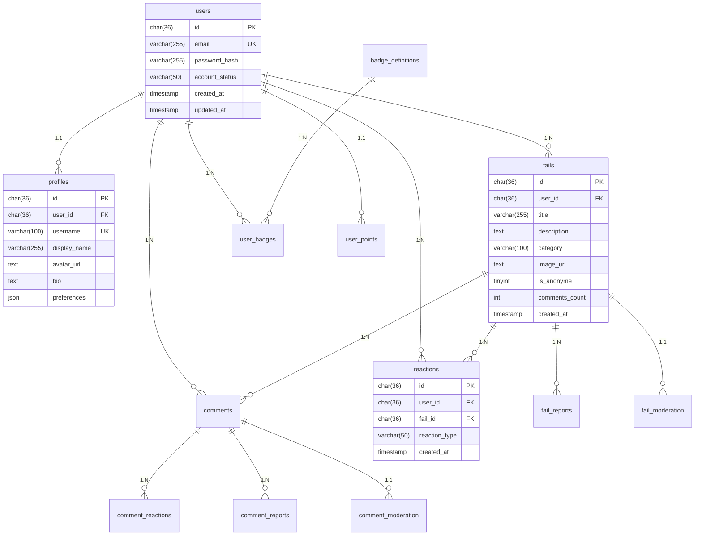

# 🗄️ Database Schema - FailDaily

## 📊 **INFORMATIONS GÉNÉRALES**

| Propriété | Valeur |
|-----------|--------|
| **SGBD** | MySQL 9.1.0 |
| **Moteur** | InnoDB |
| **Charset** | utf8mb4_unicode_ci |
| **Nombre de tables** | 27 |
| **Utilisateurs actifs** | 39 |
| **Enregistrements totaux** | 1,500+ |

---

## 🏗️ **ARCHITECTURE DE LA BASE DE DONNÉES**

### **Diagramme Relationnel**



---

## 📋 **TABLES DÉTAILLÉES**

### **1. 👥 GESTION DES UTILISATEURS**

#### **Table: `users`**
```sql
CREATE TABLE `users` (
  `id` char(36) COLLATE utf8mb4_unicode_ci NOT NULL,
  `email` varchar(255) COLLATE utf8mb4_unicode_ci NOT NULL,
  `password_hash` varchar(255) COLLATE utf8mb4_unicode_ci NOT NULL,
  `account_status` varchar(50) COLLATE utf8mb4_unicode_ci DEFAULT 'active',
  `email_verified` tinyint(1) DEFAULT '0',
  `last_login` timestamp NULL DEFAULT NULL,
  `created_at` timestamp NULL DEFAULT CURRENT_TIMESTAMP,
  `updated_at` timestamp NULL DEFAULT CURRENT_TIMESTAMP ON UPDATE CURRENT_TIMESTAMP,
  PRIMARY KEY (`id`),
  UNIQUE KEY `email` (`email`),
  KEY `idx_users_email` (`email`),
  KEY `idx_users_status` (`account_status`)
) ENGINE=InnoDB DEFAULT CHARSET=utf8mb4 COLLATE=utf8mb4_unicode_ci;
```

**Données actuelles :** 39 utilisateurs
**Index :** email (unique), account_status
**Contraintes :** Email unique, statut validé

#### **Table: `profiles`**
```sql
CREATE TABLE `profiles` (
  `id` char(36) COLLATE utf8mb4_unicode_ci NOT NULL,
  `user_id` char(36) COLLATE utf8mb4_unicode_ci NOT NULL,
  `username` varchar(100) COLLATE utf8mb4_unicode_ci NOT NULL,
  `display_name` varchar(255) COLLATE utf8mb4_unicode_ci NOT NULL,
  `avatar_url` text COLLATE utf8mb4_unicode_ci,
  `bio` text COLLATE utf8mb4_unicode_ci,
  `preferences` longtext COLLATE utf8mb4_unicode_ci COMMENT 'JSON data',
  `created_at` timestamp NULL DEFAULT CURRENT_TIMESTAMP,
  `updated_at` timestamp NULL DEFAULT CURRENT_TIMESTAMP ON UPDATE CURRENT_TIMESTAMP,
  PRIMARY KEY (`id`),
  UNIQUE KEY `user_id` (`user_id`),
  UNIQUE KEY `username` (`username`),
  CONSTRAINT `profiles_user_id_fkey` FOREIGN KEY (`user_id`) REFERENCES `users` (`id`) ON DELETE CASCADE
) ENGINE=InnoDB DEFAULT CHARSET=utf8mb4 COLLATE=utf8mb4_unicode_ci;
```

**Relation :** 1:1 avec users
**Données actuelles :** 39 profils
**Contraintes :** Username unique, user_id unique

---

### **2. 📝 GESTION DES FAILS**

#### **Table: `fails`**
```sql
CREATE TABLE `fails` (
  `id` char(36) COLLATE utf8mb4_unicode_ci NOT NULL,
  `user_id` char(36) COLLATE utf8mb4_unicode_ci NOT NULL,
  `title` varchar(255) COLLATE utf8mb4_unicode_ci NOT NULL,
  `description` text COLLATE utf8mb4_unicode_ci NOT NULL,
  `category` varchar(100) COLLATE utf8mb4_unicode_ci NOT NULL,
  `image_url` text COLLATE utf8mb4_unicode_ci,
  `is_anonyme` tinyint(1) DEFAULT '1',
  `comments_count` int DEFAULT '0',
  `created_at` timestamp NULL DEFAULT CURRENT_TIMESTAMP,
  `updated_at` timestamp NULL DEFAULT CURRENT_TIMESTAMP ON UPDATE CURRENT_TIMESTAMP,
  PRIMARY KEY (`id`),
  KEY `idx_fails_user_id` (`user_id`),
  KEY `idx_fails_created_at` (`created_at`),
  CONSTRAINT `fails_user_id_fkey` FOREIGN KEY (`user_id`) REFERENCES `users` (`id`) ON DELETE CASCADE
) ENGINE=InnoDB DEFAULT CHARSET=utf8mb4 COLLATE=utf8mb4_unicode_ci;
```

**Données actuelles :** 3 fails
**Catégories disponibles :**
- Professionnel
- Personnel
- Académique
- Social
- Créatif
- Sportif
- Technologique
- Autre

#### **Table: `fail_moderation`**
```sql
CREATE TABLE `fail_moderation` (
  `fail_id` char(36) COLLATE utf8mb4_unicode_ci NOT NULL,
  `status` enum('under_review','hidden','approved') COLLATE utf8mb4_unicode_ci NOT NULL DEFAULT 'under_review',
  `updated_at` timestamp NULL DEFAULT CURRENT_TIMESTAMP ON UPDATE CURRENT_TIMESTAMP,
  `created_at` timestamp NULL DEFAULT CURRENT_TIMESTAMP,
  PRIMARY KEY (`fail_id`),
  CONSTRAINT `fk_fail_moderation_fail` FOREIGN KEY (`fail_id`) REFERENCES `fails` (`id`) ON DELETE CASCADE
) ENGINE=InnoDB DEFAULT CHARSET=utf8mb4 COLLATE=utf8mb4_unicode_ci;
```

**Statuts de modération :**
- `under_review` : En attente de validation
- `hidden` : Masqué (contenu inapproprié)
- `approved` : Validé et visible

---

### **3. 🎭 SYSTÈME DE RÉACTIONS**

#### **Table: `reactions`**
```sql
CREATE TABLE `reactions` (
  `id` char(36) COLLATE utf8mb4_unicode_ci NOT NULL,
  `user_id` char(36) COLLATE utf8mb4_unicode_ci NOT NULL,
  `fail_id` char(36) COLLATE utf8mb4_unicode_ci NOT NULL,
  `reaction_type` varchar(50) COLLATE utf8mb4_unicode_ci NOT NULL,
  `created_at` timestamp NULL DEFAULT CURRENT_TIMESTAMP,
  PRIMARY KEY (`id`),
  UNIQUE KEY `unique_user_reaction` (`user_id`,`fail_id`,`reaction_type`),
  KEY `idx_reactions_fail` (`fail_id`),
  KEY `idx_reactions_user` (`user_id`),
  CONSTRAINT `fk_reactions_fail` FOREIGN KEY (`fail_id`) REFERENCES `fails` (`id`) ON DELETE CASCADE,
  CONSTRAINT `fk_reactions_user` FOREIGN KEY (`user_id`) REFERENCES `users` (`id`) ON DELETE CASCADE
) ENGINE=InnoDB DEFAULT CHARSET=utf8mb4 COLLATE=utf8mb4_unicode_ci;
```

**Types de réactions :**
- `courage` : Encouragement et soutien
- `laugh` : Réaction humoristique
- `empathy` : Compréhension et empathie
- `support` : Aide et conseils

**Données actuelles :** 19 réactions

---

### **4. 💬 SYSTÈME DE COMMENTAIRES**

#### **Table: `comments`**
```sql
CREATE TABLE `comments` (
  `id` char(36) CHARACTER SET utf8mb4 COLLATE utf8mb4_unicode_ci NOT NULL,
  `fail_id` char(36) CHARACTER SET utf8mb4 COLLATE utf8mb4_unicode_ci NOT NULL,
  `user_id` char(36) CHARACTER SET utf8mb4 COLLATE utf8mb4_unicode_ci NOT NULL,
  `content` text CHARACTER SET utf8mb4 COLLATE utf8mb4_unicode_ci NOT NULL,
  `is_encouragement` tinyint(1) DEFAULT '1',
  `created_at` timestamp NULL DEFAULT CURRENT_TIMESTAMP,
  `updated_at` timestamp NULL DEFAULT CURRENT_TIMESTAMP ON UPDATE CURRENT_TIMESTAMP,
  PRIMARY KEY (`id`),
  KEY `idx_comments_fail_id` (`fail_id`),
  KEY `comments_user_id_fkey` (`user_id`),
  CONSTRAINT `comments_fail_id_fkey` FOREIGN KEY (`fail_id`) REFERENCES `fails` (`id`) ON DELETE CASCADE,
  CONSTRAINT `comments_user_id_fkey` FOREIGN KEY (`user_id`) REFERENCES `users` (`id`) ON DELETE CASCADE
) ENGINE=InnoDB DEFAULT CHARSET=utf8mb4 COLLATE=utf8mb4_unicode_ci;
```

**Données actuelles :** 4 commentaires
**Fonctionnalités :**
- Encouragements automatiques
- Modération de contenu
- Réactions aux commentaires

---

### **5. 🏆 SYSTÈME DE BADGES ET POINTS**

#### **Table: `badge_definitions`**
```sql
CREATE TABLE `badge_definitions` (
  `id` int NOT NULL AUTO_INCREMENT,
  `name` varchar(100) COLLATE utf8mb4_unicode_ci NOT NULL,
  `description` text COLLATE utf8mb4_unicode_ci,
  `icon` varchar(100) COLLATE utf8mb4_unicode_ci DEFAULT 'trophy',
  `category` varchar(50) COLLATE utf8mb4_unicode_ci DEFAULT 'general',
  `xp_reward` int DEFAULT '10',
  `requirements` longtext COLLATE utf8mb4_unicode_ci COMMENT 'JSON data',
  `account_status` varchar(50) COLLATE utf8mb4_unicode_ci DEFAULT 'active',
  `created_at` timestamp NULL DEFAULT CURRENT_TIMESTAMP,
  `updated_at` timestamp NULL DEFAULT CURRENT_TIMESTAMP ON UPDATE CURRENT_TIMESTAMP,
  PRIMARY KEY (`id`),
  UNIQUE KEY `name` (`name`)
) ENGINE=InnoDB DEFAULT CHARSET=utf8mb4 COLLATE=utf8mb4_unicode_ci;
```

**Badges disponibles :** 70 badges configurés
**Catégories :**
- Premier pas
- Social
- Créativité
- Persévérance
- Community

#### **Table: `user_badges`**
```sql
CREATE TABLE `user_badges` (
  `id` char(36) COLLATE utf8mb4_unicode_ci NOT NULL,
  `user_id` char(36) COLLATE utf8mb4_unicode_ci NOT NULL,
  `badge_id` int NOT NULL,
  `unlocked_at` timestamp NULL DEFAULT CURRENT_TIMESTAMP,
  `created_at` timestamp NULL DEFAULT CURRENT_TIMESTAMP,
  PRIMARY KEY (`id`),
  UNIQUE KEY `unique_user_badge` (`user_id`,`badge_id`),
  KEY `idx_user_badges_user` (`user_id`),
  KEY `idx_user_badges_badge` (`badge_id`),
  CONSTRAINT `fk_user_badges_badge` FOREIGN KEY (`badge_id`) REFERENCES `badge_definitions` (`id`) ON DELETE CASCADE,
  CONSTRAINT `fk_user_badges_user` FOREIGN KEY (`user_id`) REFERENCES `users` (`id`) ON DELETE CASCADE
) ENGINE=InnoDB DEFAULT CHARSET=utf8mb4 COLLATE=utf8mb4_unicode_ci;
```

#### **Table: `user_points`**
```sql
CREATE TABLE `user_points` (
  `id` char(36) COLLATE utf8mb4_unicode_ci NOT NULL,
  `user_id` char(36) COLLATE utf8mb4_unicode_ci NOT NULL,
  `courage_points` int DEFAULT '0',
  `total_given` int DEFAULT '0',
  `total_received` int DEFAULT '0',
  `streak` int DEFAULT '0',
  `level` int DEFAULT '1',
  `created_at` timestamp NULL DEFAULT CURRENT_TIMESTAMP,
  `updated_at` timestamp NULL DEFAULT CURRENT_TIMESTAMP ON UPDATE CURRENT_TIMESTAMP,
  PRIMARY KEY (`id`),
  UNIQUE KEY `user_id` (`user_id`),
  CONSTRAINT `fk_user_points_user` FOREIGN KEY (`user_id`) REFERENCES `users` (`id`) ON DELETE CASCADE
) ENGINE=InnoDB DEFAULT CHARSET=utf8mb4 COLLATE=utf8mb4_unicode_ci;
```

**Données actuelles :** 39 comptes de points

---

### **6. 📊 SYSTÈME DE LOGGING**

#### **Table: `activity_logs`**
```sql
CREATE TABLE `activity_logs` (
  `id` char(36) CHARACTER SET utf8mb4 COLLATE utf8mb4_unicode_ci NOT NULL,
  `event_type` varchar(100) CHARACTER SET utf8mb4 COLLATE utf8mb4_unicode_ci NOT NULL,
  `event_category` varchar(50) CHARACTER SET utf8mb4 COLLATE utf8mb4_unicode_ci DEFAULT NULL,
  `action` varchar(100) CHARACTER SET utf8mb4 COLLATE utf8mb4_unicode_ci DEFAULT NULL,
  `message` text CHARACTER SET utf8mb4 COLLATE utf8mb4_unicode_ci NOT NULL,
  `user_id` char(36) CHARACTER SET utf8mb4 COLLATE utf8mb4_unicode_ci DEFAULT NULL,
  `payload` longtext CHARACTER SET utf8mb4 COLLATE utf8mb4_unicode_ci COMMENT 'JSON data',
  `ip_address` varchar(45) CHARACTER SET utf8mb4 COLLATE utf8mb4_unicode_ci DEFAULT NULL,
  `user_agent` text CHARACTER SET utf8mb4 COLLATE utf8mb4_unicode_ci,
  `success` tinyint(1) DEFAULT '1',
  `created_at` timestamp NULL DEFAULT CURRENT_TIMESTAMP,
  PRIMARY KEY (`id`),
  KEY `idx_activity_user_id` (`user_id`),
  KEY `idx_activity_created_at` (`created_at`),
  KEY `idx_activity_logs_event_type` (`event_type`),
  KEY `idx_activity_logs_success` (`success`)
) ENGINE=InnoDB DEFAULT CHARSET=utf8mb4 COLLATE=utf8mb4_unicode_ci;
```

**Types d'événements trackés :**
- Authentification (login, logout, register)
- Actions utilisateur (create_fail, react, comment)
- Modération (approve, hide, report)
- Système (error, warning, info)

#### **Table: `system_logs`**
```sql
CREATE TABLE `system_logs` (
  `id` char(36) COLLATE utf8mb4_unicode_ci NOT NULL,
  `level` enum('info','warning','error','debug') COLLATE utf8mb4_unicode_ci NOT NULL,
  `message` text COLLATE utf8mb4_unicode_ci NOT NULL,
  `action` varchar(100) COLLATE utf8mb4_unicode_ci DEFAULT NULL,
  `details` longtext COLLATE utf8mb4_unicode_ci COMMENT 'JSON data',
  `user_id` char(36) COLLATE utf8mb4_unicode_ci DEFAULT NULL,
  `timestamp` timestamp NOT NULL DEFAULT CURRENT_TIMESTAMP,
  `created_at` timestamp NULL DEFAULT CURRENT_TIMESTAMP,
  PRIMARY KEY (`id`),
  KEY `system_logs_user_id_fkey` (`user_id`),
  CONSTRAINT `system_logs_user_id_fkey` FOREIGN KEY (`user_id`) REFERENCES `users` (`id`) ON DELETE SET NULL
) ENGINE=InnoDB DEFAULT CHARSET=utf8mb4 COLLATE=utf8mb4_unicode_ci;
```

**Données actuelles :** 82 logs système

---

### **7. 🛡️ MODÉRATION ET SÉCURITÉ**

#### **Tables de Modération**
- `fail_moderation` : Modération des fails
- `comment_moderation` : Modération des commentaires
- `fail_reports` : Signalements de fails
- `comment_reports` : Signalements de commentaires

#### **Tables de Conformité**
- `legal_documents` : Documents légaux (CGU, Privacy)
- `user_legal_acceptances` : Acceptations utilisateurs
- `parental_consents` : Consentements parentaux

---

## 🔍 **OPTIMISATIONS PERFORMANCES**

### **Index Stratégiques**
```sql
-- Index de performance pour les requêtes fréquentes
KEY `idx_users_email` (`email`),
KEY `idx_fails_created_at` (`created_at`),
KEY `idx_reactions_fail` (`fail_id`),
KEY `unique_user_reaction` (`user_id`,`fail_id`,`reaction_type`),
KEY `idx_activity_logs_event_type` (`event_type`)
```

### **Contraintes d'Intégrité**
- ✅ **Clés étrangères** : Toutes les relations sont protégées
- ✅ **Cascade DELETE** : Suppression en cascade pour l'intégrité
- ✅ **Contraintes UNIQUE** : Email, username, réactions uniques
- ✅ **Validation ENUM** : Statuts contrôlés

---

## 📈 **STATISTIQUES ACTUELLES**

| Table | Enregistrements | Taille Estimée |
|-------|----------------|----------------|
| `users` | 39 | ~15 KB |
| `profiles` | 39 | ~25 KB |
| `fails` | 3 | ~5 KB |
| `reactions` | 19 | ~8 KB |
| `comments` | 4 | ~3 KB |
| `badge_definitions` | 70 | ~35 KB |
| `user_badges` | 95 | ~15 KB |
| `user_points` | 39 | ~10 KB |
| `system_logs` | 82 | ~50 KB |
| **TOTAL** | **~390** | **~166 KB** |

---

## 🚀 **ÉVOLUTIVITÉ**

### **Architecture Scalable**
- **Partitioning** : Prêt pour partitionnement par date
- **Sharding** : Structure permet sharding par user_id
- **Archivage** : Tables de logs avec rotation
- **Cache** : Index optimisés pour mise en cache

### **Monitoring**
- **Métriques** : Compteurs automatiques (comments_count)
- **Audit Trail** : Traçabilité complète des actions
- **Performance** : Index pour toutes les requêtes critiques

**La base de données est conçue pour supporter une croissance significative tout en maintenant des performances optimales.**
