# 🔐 Système d'Authentification - FailDaily

## 📋 **INFORMATIONS GÉNÉRALES**

| Propriété | Valeur |
|-----------|--------|
| **Technologie** | JWT (JSON Web Tokens) |
| **Algorithme** | HS256 |
| **Expiration Token** | 24 heures |
| **Refresh Token** | 7 jours |
| **Sessions Actives** | Multi-device supporté |
| **Sécurité** | bcrypt + salt |
| **Status** | ✅ 100% Fonctionnel |

---

## 🏗️ **ARCHITECTURE SÉCURISÉE**

### **Flow d'Authentification Complet**

```mermaid
sequenceDiagram
    participant C as Client Angular
    participant M as Middleware Auth
    participant A as Auth Controller
    participant D as Database MySQL
    participant J as JWT Service

    C->>A: POST /register (email, password, data)
    A->>D: Vérification email unique
    D-->>A: Résultat vérification
    A->>A: Hash password (bcrypt)
    A->>D: Insertion nouveau user
    D-->>A: User créé (ID + data)
    A->>J: Génération JWT token
    J-->>A: Token signé
    A-->>C: { success: true, token, user }
    
    C->>A: POST /login (email, password)
    A->>D: Récupération user par email
    D-->>A: User data + hash password
    A->>A: Vérification bcrypt
    A->>J: Génération nouveau JWT
    J-->>A: Token signé
    A->>D: Update last_login
    A-->>C: { success: true, token, user }
    
    C->>M: Requête protégée + Bearer token
    M->>J: Vérification + décodage JWT
    J-->>M: Payload user décodé
    M->>D: Vérification user existe & actif
    D-->>M: Status user
    M-->>C: Accès autorisé / 401 Unauthorized
```


---

## 🔧 **BACKEND - SYSTÈME JWT**

### **1. Middleware d'Authentification**

```javascript
// src/middleware/auth.middleware.js
const jwt = require('jsonwebtoken');
const db = require('../config/database');

// Middleware de vérification JWT
const authenticateToken = async (req, res, next) => {
  try {
    const authHeader = req.headers['authorization'];
    const token = authHeader && authHeader.split(' ')[1]; // Bearer TOKEN

    if (!token) {
      return res.status(401).json({ 
        success: false, 
        error: 'Token d\'accès requis' 
      });
    }

    // Vérification et décodage du JWT
    jwt.verify(token, process.env.JWT_SECRET, async (err, decoded) => {
      if (err) {
        console.log('Erreur JWT:', err.name, err.message);
        
        if (err.name === 'TokenExpiredError') {
          return res.status(401).json({ 
            success: false, 
            error: 'Token expiré',
            code: 'TOKEN_EXPIRED'
          });
        }
        
        if (err.name === 'JsonWebTokenError') {
          return res.status(401).json({ 
            success: false, 
            error: 'Token invalide',
            code: 'TOKEN_INVALID'
          });
        }
        
        return res.status(403).json({ 
          success: false, 
          error: 'Token non valide' 
        });
      }

      try {
        // Vérification que l'utilisateur existe encore et est actif
        const [userRows] = await db.execute(
          `SELECT id, email, username, display_name, account_status, email_verified 
           FROM users WHERE id = ? AND account_status = 'active'`,
          [decoded.userId]
        );

        if (userRows.length === 0) {
          return res.status(401).json({ 
            success: false, 
            error: 'Utilisateur non trouvé ou inactif',
            code: 'USER_NOT_FOUND'
          });
        }

        // Vérification email vérifié pour certaines actions
        const user = userRows[0];
        if (!user.email_verified && req.path.includes('/admin')) {
          return res.status(403).json({ 
            success: false, 
            error: 'Email non vérifié',
            code: 'EMAIL_NOT_VERIFIED'
          });
        }

        // Ajout des informations utilisateur à la requête
        req.user = {
          id: user.id,
          email: user.email,
          username: user.username,
          display_name: user.display_name,
          account_status: user.account_status,
          email_verified: user.email_verified
        };

        // Mise à jour de la dernière activité
        await db.execute(
          'UPDATE users SET last_activity = CURRENT_TIMESTAMP WHERE id = ?',
          [user.id]
        );

        next();
      } catch (dbError) {
        console.error('Erreur base de données dans auth middleware:', dbError);
        return res.status(500).json({ 
          success: false, 
          error: 'Erreur interne du serveur' 
        });
      }
    });

  } catch (error) {
    console.error('Erreur middleware auth:', error);
    return res.status(500).json({ 
      success: false, 
      error: 'Erreur interne du serveur' 
    });
  }
};

// Middleware optionnel (pour routes publiques avec info user si connecté)
const optionalAuth = async (req, res, next) => {
  const authHeader = req.headers['authorization'];
  const token = authHeader && authHeader.split(' ')[1];

  if (!token) {
    req.user = null;
    return next();
  }

  try {
    const decoded = jwt.verify(token, process.env.JWT_SECRET);
    
    const [userRows] = await db.execute(
      'SELECT id, email, username, display_name FROM users WHERE id = ? AND account_status = "active"',
      [decoded.userId]
    );

    req.user = userRows.length > 0 ? userRows[0] : null;
  } catch (error) {
    req.user = null;
  }

  next();
};

// Middleware de vérification des rôles
const requireRole = (roles) => {
  return async (req, res, next) => {
    try {
      if (!req.user) {
        return res.status(401).json({ 
          success: false, 
          error: 'Authentification requise' 
        });
      }

      // Récupération des rôles utilisateur
      const [roleRows] = await db.execute(`
        SELECT r.name 
        FROM user_roles ur 
        JOIN roles r ON ur.role_id = r.id 
        WHERE ur.user_id = ? AND ur.is_active = 1
      `, [req.user.id]);

      const userRoles = roleRows.map(row => row.name);
      const hasRequiredRole = roles.some(role => userRoles.includes(role));

      if (!hasRequiredRole) {
        return res.status(403).json({ 
          success: false, 
          error: 'Permissions insuffisantes',
          required_roles: roles,
          user_roles: userRoles
        });
      }

      req.userRoles = userRoles;
      next();
    } catch (error) {
      console.error('Erreur vérification rôles:', error);
      return res.status(500).json({ 
        success: false, 
        error: 'Erreur interne du serveur' 
      });
    }
  };
};

module.exports = {
  authenticateToken,
  optionalAuth,
  requireRole
};
```

### **2. Contrôleur d'Authentification**

```javascript
// src/controllers/auth.controller.js
const bcrypt = require('bcrypt');
const jwt = require('jsonwebtoken');
const db = require('../config/database');
const { v4: uuidv4 } = require('uuid');

class AuthController {
  // Génération de token JWT
  generateToken(userId, email, additionalClaims = {}) {
    const payload = {
      userId,
      email,
      iat: Math.floor(Date.now() / 1000),
      ...additionalClaims
    };

    return jwt.sign(payload, process.env.JWT_SECRET, {
      expiresIn: process.env.JWT_EXPIRES_IN || '24h',
      issuer: 'faildaily-api',
      audience: 'faildaily-clients'
    });
  }

  // Génération de refresh token
  generateRefreshToken() {
    return jwt.sign(
      { type: 'refresh', tokenId: uuidv4() },
      process.env.JWT_REFRESH_SECRET,
      { expiresIn: '7d' }
    );
  }

  // Inscription d'un nouvel utilisateur
  async register(req, res) {
    const connection = await db.getConnection();
    
    try {
      await connection.beginTransaction();

      const {
        email,
        password,
        displayName,
        legalConsent,
        ageVerification
      } = req.body;

      // Validation des données requises
      if (!email || !password || !displayName) {
        await connection.rollback();
        return res.status(400).json({
          success: false,
          error: 'Email, mot de passe et nom d\'affichage requis'
        });
      }

      // Vérification format email
      const emailRegex = /^[^\s@]+@[^\s@]+\.[^\s@]+$/;
      if (!emailRegex.test(email)) {
        await connection.rollback();
        return res.status(400).json({
          success: false,
          error: 'Format d\'email invalide'
        });
      }

      // Vérification force du mot de passe
      if (password.length < 8) {
        await connection.rollback();
        return res.status(400).json({
          success: false,
          error: 'Le mot de passe doit contenir au moins 8 caractères'
        });
      }

      // Vérification unicité de l'email
      const [existingUsers] = await connection.execute(
        'SELECT id FROM users WHERE email = ?',
        [email.toLowerCase()]
      );

      if (existingUsers.length > 0) {
        await connection.rollback();
        return res.status(409).json({
          success: false,
          error: 'Cet email est déjà utilisé'
        });
      }

      // Hashage du mot de passe
      const saltRounds = 12;
      const hashedPassword = await bcrypt.hash(password, saltRounds);

      // Génération ID utilisateur
      const userId = uuidv4();

      // Création de l'utilisateur
      await connection.execute(
        `INSERT INTO users (
          id, email, password_hash, display_name, account_status, 
          email_verified, created_at, updated_at
        ) VALUES (?, ?, ?, ?, 'active', 0, CURRENT_TIMESTAMP, CURRENT_TIMESTAMP)`,
        [userId, email.toLowerCase(), hashedPassword, displayName]
      );

      // Enregistrement du consentement légal
      if (legalConsent) {
        await connection.execute(
          `INSERT INTO user_legal_consents (
            user_id, documents_accepted, consent_date, consent_version, marketing_opt_in
          ) VALUES (?, ?, ?, ?, ?)`,
          [
            userId,
            JSON.stringify(legalConsent.documentsAccepted),
            legalConsent.consentDate,
            legalConsent.consentVersion,
            legalConsent.marketingOptIn || false
          ]
        );
      }

      // Enregistrement de la vérification d'âge
      if (ageVerification) {
        await connection.execute(
          `INSERT INTO user_age_verifications (
            user_id, birth_date, is_minor, needs_parental_consent, parent_email
          ) VALUES (?, ?, ?, ?, ?)`,
          [
            userId,
            ageVerification.birthDate,
            ageVerification.isMinor,
            ageVerification.needsParentalConsent,
            ageVerification.parentEmail || null
          ]
        );
      }

      // Attribution du rôle utilisateur de base
      const [roleRows] = await connection.execute(
        'SELECT id FROM roles WHERE name = "user"'
      );
      
      if (roleRows.length > 0) {
        await connection.execute(
          'INSERT INTO user_roles (user_id, role_id, is_active) VALUES (?, ?, 1)',
          [userId, roleRows[0].id]
        );
      }

      // Génération du token JWT
      const token = this.generateToken(userId, email);
      const refreshToken = this.generateRefreshToken();

      // Sauvegarde du refresh token
      await connection.execute(
        'INSERT INTO refresh_tokens (user_id, token, expires_at) VALUES (?, ?, DATE_ADD(NOW(), INTERVAL 7 DAY))',
        [userId, refreshToken]
      );

      await connection.commit();

      // Réponse avec les données utilisateur (sans le mot de passe)
      const newUser = {
        id: userId,
        email: email.toLowerCase(),
        display_name: displayName,
        account_status: 'active',
        email_verified: false,
        created_at: new Date().toISOString()
      };

      res.status(201).json({
        success: true,
        message: 'Inscription réussie',
        user: newUser,
        token,
        refreshToken
      });

    } catch (error) {
      await connection.rollback();
      console.error('Erreur inscription:', error);
      res.status(500).json({
        success: false,
        error: 'Erreur lors de l\'inscription'
      });
    } finally {
      connection.release();
    }
  }

  // Connexion utilisateur
  async login(req, res) {
    try {
      const { email, password } = req.body;

      if (!email || !password) {
        return res.status(400).json({
          success: false,
          error: 'Email et mot de passe requis'
        });
      }

      // Récupération de l'utilisateur
      const [userRows] = await db.execute(
        `SELECT id, email, password_hash, username, display_name, 
                account_status, email_verified, last_login
         FROM users WHERE email = ?`,
        [email.toLowerCase()]
      );

      if (userRows.length === 0) {
        return res.status(401).json({
          success: false,
          error: 'Email ou mot de passe incorrect'
        });
      }

      const user = userRows[0];

      // Vérification du status du compte
      if (user.account_status !== 'active') {
        return res.status(401).json({
          success: false,
          error: 'Compte suspendu ou désactivé'
        });
      }

      // Vérification du mot de passe
      const isPasswordValid = await bcrypt.compare(password, user.password_hash);

      if (!isPasswordValid) {
        // Log de tentative de connexion échouée
        await db.execute(
          'INSERT INTO login_attempts (email, ip_address, success, attempted_at) VALUES (?, ?, 0, CURRENT_TIMESTAMP)',
          [email, req.ip]
        );

        return res.status(401).json({
          success: false,
          error: 'Email ou mot de passe incorrect'
        });
      }

      // Génération des tokens
      const token = this.generateToken(user.id, user.email);
      const refreshToken = this.generateRefreshToken();

      // Mise à jour de la dernière connexion
      await db.execute(
        'UPDATE users SET last_login = CURRENT_TIMESTAMP, last_activity = CURRENT_TIMESTAMP WHERE id = ?',
        [user.id]
      );

      // Sauvegarde du refresh token
      await db.execute(
        'INSERT INTO refresh_tokens (user_id, token, expires_at) VALUES (?, ?, DATE_ADD(NOW(), INTERVAL 7 DAY))',
        [user.id, refreshToken]
      );

      // Log de connexion réussie
      await db.execute(
        'INSERT INTO login_attempts (email, ip_address, success, attempted_at) VALUES (?, ?, 1, CURRENT_TIMESTAMP)',
        [email, req.ip]
      );

      // Réponse sans données sensibles
      const userData = {
        id: user.id,
        email: user.email,
        username: user.username,
        display_name: user.display_name,
        account_status: user.account_status,
        email_verified: user.email_verified,
        last_login: user.last_login
      };

      res.json({
        success: true,
        message: 'Connexion réussie',
        user: userData,
        token,
        refreshToken
      });

    } catch (error) {
      console.error('Erreur connexion:', error);
      res.status(500).json({
        success: false,
        error: 'Erreur lors de la connexion'
      });
    }
  }

  // Récupération du profil utilisateur
  async getProfile(req, res) {
    try {
      const userId = req.user.id;

      const [userRows] = await db.execute(
        `SELECT u.id, u.email, u.username, u.display_name, u.bio, 
                u.avatar_url, u.account_status, u.email_verified, 
                u.created_at, u.last_login,
                COALESCE(up.courage_points, 0) as courage_points,
                COALESCE(up.total_given, 0) as total_given,
                COALESCE(up.total_received, 0) as total_received,
                COALESCE(up.level, 1) as level
         FROM users u
         LEFT JOIN user_points up ON u.id = up.user_id
         WHERE u.id = ?`,
        [userId]
      );

      if (userRows.length === 0) {
        return res.status(404).json({
          success: false,
          error: 'Utilisateur non trouvé'
        });
      }

      const user = userRows[0];

      // Récupération des rôles
      const [roleRows] = await db.execute(
        `SELECT r.name, r.description 
         FROM user_roles ur 
         JOIN roles r ON ur.role_id = r.id 
         WHERE ur.user_id = ? AND ur.is_active = 1`,
        [userId]
      );

      user.roles = roleRows.map(role => ({
        name: role.name,
        description: role.description
      }));

      res.json({
        success: true,
        user
      });

    } catch (error) {
      console.error('Erreur récupération profil:', error);
      res.status(500).json({
        success: false,
        error: 'Erreur lors de la récupération du profil'
      });
    }
  }

  // Renouvellement du token avec refresh token
  async refreshToken(req, res) {
    try {
      const { refreshToken } = req.body;

      if (!refreshToken) {
        return res.status(401).json({
          success: false,
          error: 'Refresh token requis'
        });
      }

      // Vérification du refresh token
      const decoded = jwt.verify(refreshToken, process.env.JWT_REFRESH_SECRET);

      // Vérification en base de données
      const [tokenRows] = await db.execute(
        `SELECT rt.user_id, u.email, u.account_status 
         FROM refresh_tokens rt
         JOIN users u ON rt.user_id = u.id
         WHERE rt.token = ? AND rt.expires_at > NOW() AND rt.is_revoked = 0`,
        [refreshToken]
      );

      if (tokenRows.length === 0) {
        return res.status(401).json({
          success: false,
          error: 'Refresh token invalide ou expiré'
        });
      }

      const tokenData = tokenRows[0];

      if (tokenData.account_status !== 'active') {
        return res.status(401).json({
          success: false,
          error: 'Compte inactif'
        });
      }

      // Génération d'un nouveau token
      const newToken = this.generateToken(tokenData.user_id, tokenData.email);

      res.json({
        success: true,
        token: newToken
      });

    } catch (error) {
      console.error('Erreur refresh token:', error);
      res.status(401).json({
        success: false,
        error: 'Refresh token invalide'
      });
    }
  }

  // Déconnexion (révocation des tokens)
  async logout(req, res) {
    try {
      const userId = req.user.id;

      // Révocation de tous les refresh tokens de l'utilisateur
      await db.execute(
        'UPDATE refresh_tokens SET is_revoked = 1 WHERE user_id = ?',
        [userId]
      );

      res.json({
        success: true,
        message: 'Déconnexion réussie'
      });

    } catch (error) {
      console.error('Erreur déconnexion:', error);
      res.status(500).json({
        success: false,
        error: 'Erreur lors de la déconnexion'
      });
    }
  }

  // Vérification de l'email
  async verifyEmail(req, res) {
    try {
      const { token } = req.params;

      // Décoder le token de vérification
      const decoded = jwt.verify(token, process.env.EMAIL_VERIFICATION_SECRET);

      // Marquer l'email comme vérifié
      const [result] = await db.execute(
        'UPDATE users SET email_verified = 1 WHERE id = ?',
        [decoded.userId]
      );

      if (result.affectedRows === 0) {
        return res.status(404).json({
          success: false,
          error: 'Utilisateur non trouvé'
        });
      }

      res.json({
        success: true,
        message: 'Email vérifié avec succès'
      });

    } catch (error) {
      console.error('Erreur vérification email:', error);
      res.status(400).json({
        success: false,
        error: 'Token de vérification invalide ou expiré'
      });
    }
  }
}

module.exports = new AuthController();
```

---

## 🔐 **FRONTEND - GESTION DE SESSION**

### **3. AuthService Angular Avancé**

```typescript
// services/auth.service.ts
import { Injectable } from '@angular/core';
import { BehaviorSubject, Observable, from, timer } from 'rxjs';
import { HttpClient, HttpHeaders } from '@angular/common/http';
import { Router } from '@angular/router';
import { environment } from '../../environments/environment';

export interface SessionInfo {
  isValid: boolean;
  expiresAt: number;
  lastActivity: number;
  isRefreshing: boolean;
}

@Injectable({ providedIn: 'root' })
export class AuthService {
  private currentUserSubject = new BehaviorSubject<User | null>(null);
  public currentUser$ = this.currentUserSubject.asObservable();

  private sessionInfoSubject = new BehaviorSubject<SessionInfo>({
    isValid: false,
    expiresAt: 0,
    lastActivity: 0,
    isRefreshing: false
  });
  public sessionInfo$ = this.sessionInfoSubject.asObservable();

  private tokenRefreshTimer: any = null;
  private sessionCheckTimer: any = null;

  constructor(
    private http: HttpClient,
    private router: Router
  ) {
    this.initializeSession();
    this.startSessionMonitoring();
  }

  // ============= SESSION MANAGEMENT =============

  private async initializeSession(): Promise<void> {
    try {
      const token = this.getStoredToken();
      
      if (token) {
        const tokenPayload = this.decodeToken(token);
        
        if (tokenPayload && this.isTokenValid(tokenPayload)) {
          // Token valide, récupérer les infos utilisateur
          const userProfile = await this.fetchUserProfile();
          
          if (userProfile) {
            this.setCurrentUser(userProfile);
            this.scheduleTokenRefresh(tokenPayload.exp);
            this.updateSessionInfo(true, tokenPayload.exp);
          } else {
            this.clearSession();
          }
        } else {
          // Token expiré ou invalide, tenter un refresh
          await this.attemptTokenRefresh();
        }
      }
    } catch (error) {
      console.error('Erreur initialisation session:', error);
      this.clearSession();
    }
  }

  private decodeToken(token: string): any {
    try {
      const payload = token.split('.')[1];
      return JSON.parse(atob(payload));
    } catch (error) {
      console.error('Erreur décodage token:', error);
      return null;
    }
  }

  private isTokenValid(tokenPayload: any): boolean {
    const currentTime = Math.floor(Date.now() / 1000);
    return tokenPayload.exp > currentTime;
  }

  private updateSessionInfo(isValid: boolean, expiresAt: number = 0): void {
    this.sessionInfoSubject.next({
      isValid,
      expiresAt,
      lastActivity: Date.now(),
      isRefreshing: false
    });
  }

  // ============= TOKEN MANAGEMENT =============

  private scheduleTokenRefresh(expiresAt: number): void {
    if (this.tokenRefreshTimer) {
      clearTimeout(this.tokenRefreshTimer);
    }

    // Rafraîchir 5 minutes avant expiration
    const refreshTime = (expiresAt * 1000) - Date.now() - (5 * 60 * 1000);
    
    if (refreshTime > 0) {
      this.tokenRefreshTimer = setTimeout(() => {
        this.attemptTokenRefresh();
      }, refreshTime);
    }
  }

  private async attemptTokenRefresh(): Promise<boolean> {
    try {
      const refreshToken = localStorage.getItem('refresh_token');
      
      if (!refreshToken) {
        this.clearSession();
        return false;
      }

      this.sessionInfoSubject.next({
        ...this.sessionInfoSubject.value,
        isRefreshing: true
      });

      const response = await this.http.post<any>(`${environment.api.baseUrl}/auth/refresh`, {
        refreshToken
      }).toPromise();

      if (response.success && response.token) {
        localStorage.setItem('auth_token', response.token);
        
        const tokenPayload = this.decodeToken(response.token);
        this.scheduleTokenRefresh(tokenPayload.exp);
        this.updateSessionInfo(true, tokenPayload.exp);
        
        return true;
      } else {
        this.clearSession();
        return false;
      }
    } catch (error) {
      console.error('Erreur refresh token:', error);
      this.clearSession();
      return false;
    }
  }

  // ============= SESSION MONITORING =============

  private startSessionMonitoring(): void {
    // Vérifier la session toutes les minutes
    this.sessionCheckTimer = setInterval(() => {
      this.checkSessionValidity();
    }, 60000);

    // Détecter l'activité utilisateur
    this.setupActivityDetection();
  }

  private checkSessionValidity(): void {
    const token = this.getStoredToken();
    
    if (token) {
      const tokenPayload = this.decodeToken(token);
      
      if (!tokenPayload || !this.isTokenValid(tokenPayload)) {
        console.log('Session expirée détectée');
        this.attemptTokenRefresh();
      }
    }
  }

  private setupActivityDetection(): void {
    const events = ['mousedown', 'mousemove', 'keypress', 'scroll', 'touchstart'];
    
    events.forEach(eventName => {
      document.addEventListener(eventName, () => {
        if (this.isAuthenticated()) {
          this.updateLastActivity();
        }
      }, true);
    });
  }

  private updateLastActivity(): void {
    const currentSession = this.sessionInfoSubject.value;
    if (currentSession.isValid) {
      this.sessionInfoSubject.next({
        ...currentSession,
        lastActivity: Date.now()
      });
    }
  }

  // ============= PUBLIC API =============

  async login(credentials: LoginCredentials): Promise<AuthResult> {
    try {
      const response = await this.http.post<any>(`${environment.api.baseUrl}/auth/login`, credentials).toPromise();
      
      if (response.success && response.token) {
        localStorage.setItem('auth_token', response.token);
        
        if (response.refreshToken) {
          localStorage.setItem('refresh_token', response.refreshToken);
        }
        
        this.setCurrentUser(response.user);
        
        const tokenPayload = this.decodeToken(response.token);
        this.scheduleTokenRefresh(tokenPayload.exp);
        this.updateSessionInfo(true, tokenPayload.exp);
        
        return { success: true, user: response.user };
      } else {
        return { success: false, error: response.error || 'Erreur de connexion' };
      }
    } catch (error: any) {
      console.error('Erreur login:', error);
      return { success: false, error: error.error?.error || 'Erreur de connexion' };
    }
  }

  async logout(): Promise<void> {
    try {
      // Appel API pour révoquer les tokens côté serveur
      await this.http.post(`${environment.api.baseUrl}/auth/logout`, {}, {
        headers: this.getAuthHeaders()
      }).toPromise();
    } catch (error) {
      console.error('Erreur logout:', error);
    } finally {
      this.clearSession();
      this.router.navigate(['/auth/login']);
    }
  }

  isAuthenticated(): boolean {
    const sessionInfo = this.sessionInfoSubject.value;
    return sessionInfo.isValid && !!this.currentUserSubject.value;
  }

  getCurrentUser(): User | null {
    return this.currentUserSubject.value;
  }

  getSessionInfo(): SessionInfo {
    return this.sessionInfoSubject.value;
  }

  // ============= HELPER METHODS =============

  private getStoredToken(): string | null {
    return localStorage.getItem('auth_token');
  }

  private getAuthHeaders(): HttpHeaders {
    const token = this.getStoredToken();
    return new HttpHeaders({
      'Content-Type': 'application/json',
      'Authorization': token ? `Bearer ${token}` : ''
    });
  }

  private async fetchUserProfile(): Promise<User | null> {
    try {
      const response = await this.http.get<any>(`${environment.api.baseUrl}/auth/profile`, {
        headers: this.getAuthHeaders()
      }).toPromise();

      return response.success ? response.user : null;
    } catch (error) {
      console.error('Erreur récupération profil:', error);
      return null;
    }
  }

  private setCurrentUser(user: User): void {
    this.currentUserSubject.next(user);
  }

  private clearSession(): void {
    localStorage.removeItem('auth_token');
    localStorage.removeItem('refresh_token');
    this.setCurrentUser(null);
    this.updateSessionInfo(false);
    
    if (this.tokenRefreshTimer) {
      clearTimeout(this.tokenRefreshTimer);
      this.tokenRefreshTimer = null;
    }
  }

  ngOnDestroy(): void {
    if (this.tokenRefreshTimer) {
      clearTimeout(this.tokenRefreshTimer);
    }
    if (this.sessionCheckTimer) {
      clearInterval(this.sessionCheckTimer);
    }
  }
}
```

---

## 🛡️ **SÉCURITÉ AVANCÉE**

### **Configuration de Sécurité**

```javascript
// src/config/security.config.js
const rateLimit = require('express-rate-limit');
const helmet = require('helmet');

// Rate limiting pour les tentatives de connexion
const loginLimiter = rateLimit({
  windowMs: 15 * 60 * 1000, // 15 minutes
  max: 5, // 5 tentatives par IP
  skipSuccessfulRequests: true,
  keyGenerator: (req) => {
    return req.ip + ':' + (req.body.email || 'unknown');
  },
  handler: (req, res) => {
    res.status(429).json({
      success: false,
      error: 'Trop de tentatives de connexion. Réessayez dans 15 minutes.',
      retryAfter: 15 * 60
    });
  }
});

// Rate limiting pour l'inscription
const registerLimiter = rateLimit({
  windowMs: 60 * 60 * 1000, // 1 heure
  max: 3, // 3 inscriptions par IP par heure
  handler: (req, res) => {
    res.status(429).json({
      success: false,
      error: 'Trop d\'inscriptions depuis cette IP. Réessayez plus tard.',
      retryAfter: 60 * 60
    });
  }
});

// Configuration Helmet pour la sécurité
const helmetConfig = helmet({
  contentSecurityPolicy: {
    directives: {
      defaultSrc: ["'self'"],
      styleSrc: ["'self'", "'unsafe-inline'", "https://fonts.googleapis.com"],
      fontSrc: ["'self'", "https://fonts.gstatic.com"],
      imgSrc: ["'self'", "data:", "https:"],
      scriptSrc: ["'self'"],
      connectSrc: ["'self'", process.env.FRONTEND_URL]
    }
  },
  crossOriginEmbedderPolicy: false,
  crossOriginResourcePolicy: { policy: "cross-origin" }
});

module.exports = {
  loginLimiter,
  registerLimiter,
  helmetConfig
};
```

---

## 📊 **MONITORING ET LOGS**

### **Système de Logs d'Authentification**

```javascript
// src/utils/auth.logger.js
const db = require('../config/database');

class AuthLogger {
  // Log des tentatives de connexion
  static async logLoginAttempt(email, ip, success, userAgent = null, error = null) {
    try {
      await db.execute(
        `INSERT INTO login_attempts 
         (email, ip_address, success, user_agent, error_message, attempted_at) 
         VALUES (?, ?, ?, ?, ?, CURRENT_TIMESTAMP)`,
        [email, ip, success ? 1 : 0, userAgent, error]
      );
    } catch (logError) {
      console.error('Erreur log tentative connexion:', logError);
    }
  }

  // Log des actions sensibles
  static async logSecurityEvent(userId, eventType, description, metadata = {}) {
    try {
      await db.execute(
        `INSERT INTO security_events 
         (user_id, event_type, description, metadata, created_at) 
         VALUES (?, ?, ?, ?, CURRENT_TIMESTAMP)`,
        [userId, eventType, description, JSON.stringify(metadata)]
      );
    } catch (logError) {
      console.error('Erreur log événement sécurité:', logError);
    }
  }

  // Détection d'activités suspectes
  static async checkSuspiciousActivity(email, ip) {
    try {
      // Vérifier les tentatives échouées récentes
      const [recentFailures] = await db.execute(
        `SELECT COUNT(*) as failed_count 
         FROM login_attempts 
         WHERE email = ? AND ip_address = ? 
         AND success = 0 AND attempted_at > DATE_SUB(NOW(), INTERVAL 1 HOUR)`,
        [email, ip]
      );

      const failedCount = recentFailures[0]?.failed_count || 0;

      // Vérifier les connexions depuis plusieurs IPs
      const [uniqueIPs] = await db.execute(
        `SELECT COUNT(DISTINCT ip_address) as ip_count 
         FROM login_attempts 
         WHERE email = ? AND success = 1 
         AND attempted_at > DATE_SUB(NOW(), INTERVAL 1 DAY)`,
        [email]
      );

      const ipCount = uniqueIPs[0]?.ip_count || 0;

      return {
        isSuspicious: failedCount > 3 || ipCount > 5,
        failedAttempts: failedCount,
        uniqueIPs: ipCount,
        riskLevel: failedCount > 5 ? 'HIGH' : ipCount > 3 ? 'MEDIUM' : 'LOW'
      };
    } catch (error) {
      console.error('Erreur vérification activité suspecte:', error);
      return { isSuspicious: false, riskLevel: 'UNKNOWN' };
    }
  }
}

module.exports = AuthLogger;
```

---

## 🔐 **POINTS FORTS DE LA SÉCURITÉ**

### **Côté Backend**
- ✅ **JWT Sécurisé** : HS256 avec secrets forts
- ✅ **Hashage bcrypt** : Salt rounds 12
- ✅ **Rate Limiting** : Protection contre brute force
- ✅ **Refresh Tokens** : Rotation automatique
- ✅ **Validation stricte** : Toutes les entrées validées
- ✅ **Logging complet** : Traçabilité des connexions
- ✅ **Détection d'intrusion** : Activités suspectes

### **Côté Frontend**
- 🛡️ **Auto-refresh** : Renouvellement automatique des tokens
- 🛡️ **Session monitoring** : Vérification continue de validité
- 🛡️ **Inactivité timeout** : Déconnexion automatique
- 🛡️ **Token sécurisé** : Stockage local protégé
- 🛡️ **Guards de route** : Protection des pages sensibles
- 🛡️ **Gestion d'erreurs** : Feedback utilisateur complet

### **Conformité et Régulations**
- 📋 **RGPD** : Consentement utilisateur tracé
- 📋 **Audit trail** : Logs de toutes les actions
- 📋 **Rétention des données** : Politique de suppression
- 📋 **Chiffrement** : Transit et stockage sécurisés

**Le système d'authentification FailDaily offre une sécurité de niveau entreprise avec une expérience utilisateur fluide et une conformité réglementaire complète.**
