# 🎯 Fonctionnalités Détaillées - FailDaily

## 📋 **INFORMATIONS GÉNÉRALES**

| Propriété | Valeur |
|-----------|--------|
| **Fonctionnalités Core** | 12 modules principaux |
| **APIs Intégrées** | 16 endpoints |
| **Système de Points** | Gamification complète |
| **Modération** | IA + Humaine |
| **Notifications** | Real-time + Email |
| **Performance** | <100ms response |
| **Status** | ✅ 100% Fonctionnel |

---

## 🏗️ **ARCHITECTURE DES FONCTIONNALITÉS**

### **Vue d'Ensemble du Système**

```mermaid
graph TB
    subgraph "USER INTERFACE"
        A[🏠 Page Accueil]
        B[📝 Publication Fail]
        C[👤 Profil Utilisateur]
        D[🏆 Système Badges]
        E[👥 Communauté]
    end
    
    subgraph "CORE FEATURES"
        F[💭 Gestion Fails]
        G[⚡ Système Réactions]
        H[💬 Commentaires]
        I[🎯 Points & Niveaux]
        J[🛡️ Modération IA]
    end
    
    subgraph "ADVANCED FEATURES"
        K[📊 Analytics]
        L[🔔 Notifications]
        M[🔍 Recherche]
        N[📱 PWA/Mobile]
        O[🌐 Multi-langue]
    end
    
    A --> F
    B --> F
    C --> I
    D --> I
    E --> G
    
    F --> H
    F --> J
    G --> I
    H --> J
    
    I --> K
    J --> L
    K --> M
    L --> N
    M --> O
```


---

## 📝 **1. SYSTÈME DE PUBLICATION DE FAILS**

### **Workflow de Publication**

```mermaid
sequenceDiagram
    participant U as Utilisateur
    participant F as Frontend
    participant A as API Backend
    participant M as Modération IA
    participant D as Database
    participant N as Notifications

    U->>F: Rédige un fail
    F->>F: Validation formulaire
    F->>A: POST /api/fails
    A->>A: Validation serveur
    A->>M: Analyse contenu (OpenAI)
    M-->>A: Score modération
    
    alt Contenu sûr (score > 0.8)
        A->>D: Insertion fail (status: approved)
        A->>N: Notification communauté
        A-->>F: {success: true, status: 'approved'}
    else Contenu suspect (score 0.5-0.8)
        A->>D: Insertion fail (status: under_review)
        A->>N: Notification modérateurs
        A-->>F: {success: true, status: 'under_review'}
    else Contenu inapproprié (score < 0.5)
        A->>D: Log tentative
        A-->>F: {success: false, error: 'Contenu inapproprié'}
    end
```


### **Code Backend - Création de Fail**

```javascript
// src/controllers/fails.controller.js
const { validateFail, moderateContent } = require('../utils/validation');
const { v4: uuidv4 } = require('uuid');

class FailsController {
  async createFail(req, res) {
    const connection = await db.getConnection();
    
    try {
      await connection.beginTransaction();

      const { title, description, category, is_anonyme } = req.body;
      const userId = req.user.id;

      // 1. Validation des données
      const validation = validateFail({ title, description, category });
      if (!validation.isValid) {
        await connection.rollback();
        return res.status(400).json({
          success: false,
          error: 'Données invalides',
          details: validation.errors
        });
      }

      // 2. Modération IA du contenu
      const moderationResult = await moderateContent(title + ' ' + description);
      
      let moderationStatus = 'approved';
      if (moderationResult.flagged) {
        moderationStatus = moderationResult.confidence < 0.5 ? 'hidden' : 'under_review';
      }

      // 3. Insertion du fail
      const failId = uuidv4();
      await connection.execute(`
        INSERT INTO fails (
          id, user_id, title, description, category, is_anonyme, 
          moderation_status, moderation_score, created_at, updated_at
        ) VALUES (?, ?, ?, ?, ?, ?, ?, ?, CURRENT_TIMESTAMP, CURRENT_TIMESTAMP)
      `, [
        failId, userId, title, description, category, 
        is_anonyme, moderationStatus, moderationResult.confidence
      ]);

      // 4. Attribution de points utilisateur
      await this.awardUserPoints(connection, userId, 'fail_created', 10);

      // 5. Vérification des badges débloqués
      const newBadges = await this.checkUnlockedBadges(connection, userId);

      // 6. Log de l'action
      await connection.execute(`
        INSERT INTO user_activity_logs (user_id, activity_type, entity_type, entity_id, metadata)
        VALUES (?, 'create', 'fail', ?, ?)
      `, [userId, failId, JSON.stringify({ category, moderation_status: moderationStatus })]);

      await connection.commit();

      // 7. Notifications asynchrones
      if (moderationStatus === 'approved') {
        this.notifyNewFail(failId, category);
      } else if (moderationStatus === 'under_review') {
        this.notifyModerators(failId, moderationResult);
      }

      res.status(201).json({
        success: true,
        fail: {
          id: failId,
          moderation_status: moderationStatus,
          points_awarded: 10,
          badges_unlocked: newBadges
        },
        message: moderationStatus === 'approved' 
          ? 'Fail publié avec succès !' 
          : 'Fail en cours de modération'
      });

    } catch (error) {
      await connection.rollback();
      console.error('Erreur création fail:', error);
      res.status(500).json({
        success: false,
        error: 'Erreur lors de la publication'
      });
    } finally {
      connection.release();
    }
  }

  // Attribution de points utilisateur
  async awardUserPoints(connection, userId, actionType, points) {
    try {
      // Vérifier si l'entrée existe
      const [existing] = await connection.execute(
        'SELECT id FROM user_points WHERE user_id = ?',
        [userId]
      );

      if (existing.length === 0) {
        // Créer nouvelle entrée
        await connection.execute(`
          INSERT INTO user_points (user_id, courage_points, total_given, level)
          VALUES (?, ?, 0, 1)
        `, [userId, points]);
      } else {
        // Mettre à jour points existants
        await connection.execute(`
          UPDATE user_points 
          SET courage_points = courage_points + ?,
              level = FLOOR(courage_points / 100) + 1
          WHERE user_id = ?
        `, [points, userId]);
      }

      // Log de l'attribution de points
      await connection.execute(`
        INSERT INTO point_transactions (user_id, action_type, points_change, balance_after)
        SELECT ?, ?, ?, courage_points 
        FROM user_points WHERE user_id = ?
      `, [userId, actionType, points, userId]);

    } catch (error) {
      console.error('Erreur attribution points:', error);
      throw error;
    }
  }
}
```

### **Code Frontend - Formulaire de Publication**

```typescript
// pages/post-fail/post-fail.page.ts
export class PostFailPage implements OnInit {
  failForm: FormGroup;
  loading = false;
  moderationWarning = false;
  previewMode = false;

  categories = [
    { id: 'work', name: 'Travail', icon: 'briefcase', color: 'primary' },
    { id: 'relationship', name: 'Relations', icon: 'heart', color: 'danger' },
    { id: 'financial', name: 'Finances', icon: 'card', color: 'warning' },
    { id: 'health', name: 'Santé', icon: 'fitness', color: 'success' },
    { id: 'education', name: 'Éducation', icon: 'school', color: 'secondary' },
    { id: 'technology', name: 'Technologie', icon: 'laptop', color: 'tertiary' },
    { id: 'lifestyle', name: 'Style de vie', icon: 'home', color: 'medium' },
    { id: 'other', name: 'Autre', icon: 'ellipsis-horizontal', color: 'dark' }
  ];

  constructor(
    private fb: FormBuilder,
    private mysqlService: MysqlService,
    private router: Router,
    private toastCtrl: ToastController,
    private alertCtrl: AlertController
  ) {
    this.initializeForm();
  }

  private initializeForm(): void {
    this.failForm = this.fb.group({
      title: ['', [
        Validators.required,
        Validators.minLength(10),
        Validators.maxLength(255),
        this.noOffensiveContentValidator
      ]],
      description: ['', [
        Validators.required,
        Validators.minLength(50),
        Validators.maxLength(2000),
        this.noOffensiveContentValidator
      ]],
      category: ['', Validators.required],
      is_anonyme: [false],
      
      // Métadonnées optionnelles
      tags: [''],
      lesson_learned: [''],
      would_do_differently: ['']
    });

    // Validation en temps réel
    this.failForm.valueChanges.pipe(
      debounceTime(500),
      distinctUntilChanged()
    ).subscribe(() => {
      this.checkContentModeration();
    });
  }

  // Validation personnalisée du contenu
  private noOffensiveContentValidator(control: AbstractControl): ValidationErrors | null {
    const value = control.value?.toLowerCase() || '';
    const offensiveWords = ['spam', 'fake', 'hate', 'violence']; // Liste simplifiée
    
    const hasOffensiveContent = offensiveWords.some(word => value.includes(word));
    return hasOffensiveContent ? { offensiveContent: true } : null;
  }

  // Vérification de modération en temps réel
  private async checkContentModeration(): Promise<void> {
    const title = this.failForm.get('title')?.value || '';
    const description = this.failForm.get('description')?.value || '';
    
    if (title.length < 10 || description.length < 50) return;

    try {
      const content = `${title} ${description}`;
      const moderationResult = await this.mysqlService.checkContentModeration(content);
      
      this.moderationWarning = moderationResult.needsReview;
      
      if (moderationResult.needsReview) {
        this.showModerationWarning(moderationResult.suggestions);
      }
    } catch (error) {
      console.error('Erreur vérification modération:', error);
    }
  }

  // Soumission du formulaire
  async onSubmit(): Promise<void> {
    if (this.failForm.invalid || this.loading) return;

    // Confirmation si contenu nécessite modération
    if (this.moderationWarning) {
      const shouldContinue = await this.confirmModerationWarning();
      if (!shouldContinue) return;
    }

    this.loading = true;

    try {
      const formData = {
        ...this.failForm.value,
        // Nettoyage et formatage
        title: this.failForm.value.title.trim(),
        description: this.failForm.value.description.trim(),
        tags: this.failForm.value.tags?.split(',').map((tag: string) => tag.trim()).filter(Boolean) || []
      };

      const result = await this.mysqlService.createFail(formData);

      if (result.success) {
        await this.showSuccessMessage(result);
        
        // Navigation avec état
        this.router.navigate(['/tabs/home'], {
          state: { 
            newFailPublished: true,
            failId: result.fail.id,
            pointsAwarded: result.fail.points_awarded,
            badgesUnlocked: result.fail.badges_unlocked
          }
        });
      } else {
        await this.showErrorMessage(result.error);
      }
    } catch (error) {
      console.error('Erreur soumission fail:', error);
      await this.showErrorMessage('Erreur lors de la publication');
    } finally {
      this.loading = false;
    }
  }

  // Messages utilisateur
  private async showSuccessMessage(result: any): Promise<void> {
    let message = 'Votre fail a été publié avec succès !';
    
    if (result.fail.moderation_status === 'under_review') {
      message = 'Votre fail est en cours de modération et sera publié prochainement.';
    }
    
    if (result.fail.points_awarded > 0) {
      message += ` (+${result.fail.points_awarded} points de courage)`;
    }

    const toast = await this.toastCtrl.create({
      message,
      duration: 4000,
      color: 'success',
      position: 'top',
      buttons: [{
        text: 'OK',
        role: 'cancel'
      }]
    });
    
    await toast.present();
  }

  // Aperçu du contenu
  togglePreview(): void {
    this.previewMode = !this.previewMode;
  }

  // Sauvegarde en brouillon
  async saveDraft(): Promise<void> {
    const draftData = {
      ...this.failForm.value,
      saved_at: new Date().toISOString()
    };
    
    localStorage.setItem('fail_draft', JSON.stringify(draftData));
    
    const toast = await this.toastCtrl.create({
      message: 'Brouillon sauvegardé',
      duration: 2000,
      color: 'medium'
    });
    
    await toast.present();
  }

  // Chargement du brouillon
  loadDraft(): void {
    const draft = localStorage.getItem('fail_draft');
    if (draft) {
      const draftData = JSON.parse(draft);
      this.failForm.patchValue(draftData);
      localStorage.removeItem('fail_draft');
    }
  }
}
```

---

## ⚡ **2. SYSTÈME DE RÉACTIONS**

### **Types de Réactions Disponibles**

| Réaction | Emoji | Signification | Points | Couleur |
|----------|-------|---------------|--------|---------|
| **Courage** | ❤️ | Respect pour le courage | +2 | Rouge |
| **Laugh** | 😄 | Situation amusante | +1 | Jaune |
| **Empathy** | 🤝 | Compréhension | +3 | Bleu |
| **Support** | 🏆 | Encouragement | +5 | Vert |

### **Code Backend - Système de Réactions**

```javascript
// src/controllers/reactions.controller.js
class ReactionsController {
  async addReaction(req, res) {
    const connection = await db.getConnection();
    
    try {
      await connection.beginTransaction();

      const { fail_id, reaction_type } = req.body;
      const userId = req.user.id;

      // Validation du type de réaction
      const validReactions = ['courage', 'laugh', 'empathy', 'support'];
      if (!validReactions.includes(reaction_type)) {
        await connection.rollback();
        return res.status(400).json({
          success: false,
          error: 'Type de réaction invalide'
        });
      }

      // Vérifier que le fail existe et n'est pas du même utilisateur
      const [failRows] = await connection.execute(
        'SELECT user_id, moderation_status FROM fails WHERE id = ?',
        [fail_id]
      );

      if (failRows.length === 0) {
        await connection.rollback();
        return res.status(404).json({
          success: false,
          error: 'Fail non trouvé'
        });
      }

      const fail = failRows[0];
      if (fail.user_id === userId) {
        await connection.rollback();
        return res.status(400).json({
          success: false,
          error: 'Impossible de réagir à son propre fail'
        });
      }

      if (fail.moderation_status !== 'approved') {
        await connection.rollback();
        return res.status(403).json({
          success: false,
          error: 'Fail non disponible pour les réactions'
        });
      }

      // Vérifier si l'utilisateur a déjà réagi
      const [existingReaction] = await connection.execute(
        'SELECT id, reaction_type FROM fail_reactions WHERE fail_id = ? AND user_id = ?',
        [fail_id, userId]
      );

      let action = 'added';
      let pointsChange = this.getReactionPoints(reaction_type);

      if (existingReaction.length > 0) {
        const current = existingReaction[0];
        
        if (current.reaction_type === reaction_type) {
          // Retirer la réaction
          await connection.execute(
            'DELETE FROM fail_reactions WHERE id = ?',
            [current.id]
          );
          action = 'removed';
          pointsChange = -pointsChange;
        } else {
          // Changer le type de réaction
          await connection.execute(
            'UPDATE fail_reactions SET reaction_type = ?, updated_at = CURRENT_TIMESTAMP WHERE id = ?',
            [reaction_type, current.id]
          );
          action = 'changed';
          pointsChange = pointsChange - this.getReactionPoints(current.reaction_type);
        }
      } else {
        // Nouvelle réaction
        await connection.execute(`
          INSERT INTO fail_reactions (fail_id, user_id, reaction_type, created_at)
          VALUES (?, ?, ?, CURRENT_TIMESTAMP)
        `, [fail_id, userId, reaction_type]);
      }

      // Mise à jour des points pour l'auteur du fail
      if (pointsChange !== 0) {
        await connection.execute(`
          UPDATE user_points 
          SET total_received = total_received + ?,
              courage_points = courage_points + ?,
              level = FLOOR(courage_points / 100) + 1
          WHERE user_id = ?
        `, [pointsChange, pointsChange, fail.user_id]);

        // Log de transaction de points
        await connection.execute(`
          INSERT INTO point_transactions (user_id, action_type, points_change, source_user_id, source_fail_id)
          VALUES (?, ?, ?, ?, ?)
        `, [fail.user_id, `reaction_${reaction_type}`, pointsChange, userId, fail_id]);
      }

      // Récupérer le résumé des réactions
      const reactionsSummary = await this.getReactionsSummary(connection, fail_id);

      // Vérifier les badges débloqués
      const newBadges = await this.checkReactionBadges(connection, fail.user_id, userId);

      await connection.commit();

      // Notification asynchrone
      if (action === 'added') {
        this.notifyReaction(fail.user_id, userId, fail_id, reaction_type);
      }

      res.json({
        success: true,
        action,
        reaction_type,
        points_change: pointsChange,
        reactions_summary: reactionsSummary,
        badges_unlocked: newBadges
      });

    } catch (error) {
      await connection.rollback();
      console.error('Erreur ajout réaction:', error);
      res.status(500).json({
        success: false,
        error: 'Erreur lors de l\'ajout de la réaction'
      });
    } finally {
      connection.release();
    }
  }

  // Points par type de réaction
  getReactionPoints(reactionType) {
    const points = {
      courage: 2,
      laugh: 1,
      empathy: 3,
      support: 5
    };
    return points[reactionType] || 0;
  }

  // Résumé des réactions pour un fail
  async getReactionsSummary(connection, failId) {
    const [reactions] = await connection.execute(`
      SELECT reaction_type, COUNT(*) as count
      FROM fail_reactions
      WHERE fail_id = ?
      GROUP BY reaction_type
    `, [failId]);

    const summary = {
      courage: 0,
      laugh: 0,
      empathy: 0,
      support: 0,
      total: 0
    };

    reactions.forEach(reaction => {
      summary[reaction.reaction_type] = parseInt(reaction.count);
      summary.total += parseInt(reaction.count);
    });

    return summary;
  }
}
```

### **Code Frontend - Composant Réactions**

```typescript
// components/reactions/reactions.component.ts
@Component({
  selector: 'app-reactions',
  templateUrl: './reactions.component.html',
  styleUrls: ['./reactions.component.scss']
})
export class ReactionsComponent implements OnInit {
  @Input() failId!: string;
  @Input() reactions: any = {};
  @Input() userReaction?: string;
  @Output() reactionChanged = new EventEmitter<any>();

  reactionTypes = [
    { 
      type: 'courage', 
      icon: 'heart', 
      label: 'Courage', 
      color: 'danger',
      description: 'Respect pour votre courage'
    },
    { 
      type: 'laugh', 
      icon: 'happy', 
      label: 'Humour', 
      color: 'warning',
      description: 'Situation amusante'
    },
    { 
      type: 'empathy', 
      icon: 'people', 
      label: 'Empathie', 
      color: 'primary',
      description: 'Je comprends'
    },
    { 
      type: 'support', 
      icon: 'trophy', 
      label: 'Soutien', 
      color: 'success',
      description: 'Encouragement'
    }
  ];

  animatingReactions = new Set<string>();

  constructor(private mysqlService: MysqlService) {}

  async onReactionClick(reactionType: string): Promise<void> {
    if (this.animatingReactions.has(reactionType)) return;

    // Animation
    this.animatingReactions.add(reactionType);
    setTimeout(() => this.animatingReactions.delete(reactionType), 600);

    try {
      const result = await this.mysqlService.addReaction(this.failId, reactionType);
      
      if (result.success) {
        // Mise à jour locale optimiste
        this.updateLocalReactions(result);
        
        // Émission pour le parent
        this.reactionChanged.emit({
          failId: this.failId,
          reaction: reactionType,
          action: result.action,
          summary: result.reactions_summary
        });

        // Animation de feedback
        this.showReactionFeedback(reactionType, result.action);
      }
    } catch (error) {
      console.error('Erreur réaction:', error);
    }
  }

  private updateLocalReactions(result: any): void {
    this.reactions = result.reactions_summary;
    
    if (result.action === 'added') {
      this.userReaction = result.reaction_type;
    } else if (result.action === 'removed') {
      this.userReaction = undefined;
    } else if (result.action === 'changed') {
      this.userReaction = result.reaction_type;
    }
  }

  private async showReactionFeedback(reactionType: string, action: string): Promise<void> {
    const reaction = this.reactionTypes.find(r => r.type === reactionType);
    if (!reaction) return;

    const message = action === 'added' 
      ? `${reaction.label} ajouté !`
      : action === 'removed'
      ? `${reaction.label} retiré`
      : `Changé pour ${reaction.label}`;

    // Toast de feedback
    const toast = await this.toastCtrl.create({
      message,
      duration: 1500,
      color: reaction.color,
      position: 'bottom',
      cssClass: 'reaction-toast'
    });

    await toast.present();
  }

  isReactionActive(reactionType: string): boolean {
    return this.userReaction === reactionType;
  }

  isReactionAnimating(reactionType: string): boolean {
    return this.animatingReactions.has(reactionType);
  }

  getReactionCount(reactionType: string): number {
    return this.reactions[reactionType] || 0;
  }

  getTotalReactions(): number {
    return this.reactions.total || 0;
  }
}
```

---

## 🏆 **3. SYSTÈME DE BADGES ET RÉCOMPENSES**

### **Structure des Badges**

```mermaid
graph LR
    subgraph "CATÉGORIES DE BADGES"
        A[🎯 Participation]
        B[❤️ Communauté]
        C[🔥 Engagement]
        D[⭐ Excellence]
        E[🎖️ Spéciaux]
    end
    
    subgraph "PROGRESSION"
        F[Bronze - 1★]
        G[Argent - 2★]
        H[Or - 3★]
        I[Platine - 4★]
        J[Diamant - 5★]
    end
    
    A --> F
    B --> G
    C --> H
    D --> I
    E --> J
```



### **Code Backend - Système de Badges**

```javascript
// src/controllers/badges.controller.js
class BadgesController {
  // Configuration des badges
  static BADGES_CONFIG = {
    // Badges de participation
    first_fail: {
      name: 'Premier Pas',
      description: 'Publié votre premier fail',
      icon: 'rocket',
      category: 'participation',
      xp_reward: 50,
      condition: { fails_count: 1 }
    },
    regular_poster: {
      name: 'Contributeur Régulier',
      description: '10 fails publiés',
      icon: 'create',
      category: 'participation',
      xp_reward: 200,
      condition: { fails_count: 10 }
    },
    storyteller: {
      name: 'Conteur',
      description: '50 fails publiés',
      icon: 'library',
      category: 'participation',
      xp_reward: 500,
      condition: { fails_count: 50 }
    },

    // Badges de communauté
    supporter: {
      name: 'Supporteur',
      description: '100 réactions données',
      icon: 'heart',
      category: 'community',
      xp_reward: 150,
      condition: { reactions_given: 100 }
    },
    motivator: {
      name: 'Motivateur',
      description: '50 réactions de soutien données',
      icon: 'trophy',
      category: 'community',
      xp_reward: 300,
      condition: { support_reactions_given: 50 }
    },

    // Badges d'engagement
    beloved: {
      name: 'Apprécié',
      description: '500 réactions reçues',
      icon: 'star',
      category: 'engagement',
      xp_reward: 400,
      condition: { reactions_received: 500 }
    },
    inspiring: {
      name: 'Inspirant',
      description: '100 réactions de courage reçues',
      icon: 'flame',
      category: 'engagement',
      xp_reward: 600,
      condition: { courage_reactions_received: 100 }
    },

    // Badges spéciaux
    early_adopter: {
      name: 'Adopteur Précoce',
      description: 'Parmi les 100 premiers utilisateurs',
      icon: 'time',
      category: 'special',
      xp_reward: 1000,
      condition: { user_rank: 100 }
    },
    mentor: {
      name: 'Mentor',
      description: '200 commentaires constructifs',
      icon: 'school',
      category: 'special',
      xp_reward: 800,
      condition: { helpful_comments: 200 }
    }
  };

  // Vérifier les badges débloqués pour un utilisateur
  async checkUnlockedBadges(connection, userId) {
    try {
      // Récupérer les statistiques utilisateur
      const [stats] = await connection.execute(`
        SELECT 
          u.id,
          u.created_at,
          COALESCE(up.courage_points, 0) as courage_points,
          COALESCE(up.total_given, 0) as reactions_given,
          COALESCE(up.total_received, 0) as reactions_received,
          
          -- Compter les fails
          (SELECT COUNT(*) FROM fails WHERE user_id = u.id AND moderation_status = 'approved') as fails_count,
          
          -- Compter les réactions par type
          (SELECT COUNT(*) FROM fail_reactions fr 
           JOIN fails f ON fr.fail_id = f.id 
           WHERE fr.user_id = u.id AND fr.reaction_type = 'support') as support_reactions_given,
           
          (SELECT COUNT(*) FROM fail_reactions fr 
           JOIN fails f ON fr.fail_id = f.id 
           WHERE f.user_id = u.id AND fr.reaction_type = 'courage') as courage_reactions_received,
           
          -- Compter les commentaires utiles
          (SELECT COUNT(*) FROM comments c 
           WHERE c.user_id = u.id AND c.is_helpful = 1) as helpful_comments,
           
          -- Rang d'inscription
          (SELECT COUNT(*) FROM users u2 WHERE u2.created_at <= u.created_at) as user_rank
          
        FROM users u
        LEFT JOIN user_points up ON u.id = up.user_id
        WHERE u.id = ?
      `, [userId]);

      if (stats.length === 0) return [];

      const userStats = stats[0];
      const newBadges = [];

      // Vérifier chaque badge
      for (const [badgeKey, badgeConfig] of Object.entries(this.BADGES_CONFIG)) {
        // Vérifier si le badge n'est pas déjà possédé
        const [existing] = await connection.execute(
          'SELECT id FROM user_badges WHERE user_id = ? AND badge_key = ?',
          [userId, badgeKey]
        );

        if (existing.length > 0) continue;

        // Vérifier les conditions
        const isUnlocked = this.checkBadgeConditions(badgeConfig.condition, userStats);
        
        if (isUnlocked) {
          // Débloquer le badge
          await connection.execute(`
            INSERT INTO user_badges (user_id, badge_key, unlocked_at)
            VALUES (?, ?, CURRENT_TIMESTAMP)
          `, [userId, badgeKey]);

          // Ajouter les points XP
          await connection.execute(`
            UPDATE user_points 
            SET courage_points = courage_points + ?
            WHERE user_id = ?
          `, [badgeConfig.xp_reward, userId]);

          newBadges.push({
            key: badgeKey,
            ...badgeConfig,
            unlocked_at: new Date().toISOString()
          });

          // Log de l'attribution
          await connection.execute(`
            INSERT INTO point_transactions (user_id, action_type, points_change, metadata)
            VALUES (?, 'badge_unlocked', ?, ?)
          `, [userId, badgeConfig.xp_reward, JSON.stringify({ badge_key: badgeKey })]);
        }
      }

      return newBadges;
    } catch (error) {
      console.error('Erreur vérification badges:', error);
      return [];
    }
  }

  // Vérifier les conditions d'un badge
  checkBadgeConditions(conditions, userStats) {
    for (const [condition, required] of Object.entries(conditions)) {
      const actual = userStats[condition] || 0;
      if (actual < required) {
        return false;
      }
    }
    return true;
  }

  // Récupérer tous les badges disponibles pour un utilisateur
  async getAvailableBadges(req, res) {
    try {
      const userId = req.user.id;

      // Badges possédés par l'utilisateur
      const [userBadges] = await db.execute(`
        SELECT badge_key, unlocked_at
        FROM user_badges
        WHERE user_id = ?
        ORDER BY unlocked_at DESC
      `, [userId]);

      const unlockedBadges = new Set(userBadges.map(b => b.badge_key));

      // Organiser par catégorie
      const badgesByCategory = {};
      let totalBadges = 0;
      let unlockedCount = 0;

      Object.entries(this.BADGES_CONFIG).forEach(([key, config]) => {
        if (!badgesByCategory[config.category]) {
          badgesByCategory[config.category] = [];
        }

        const isUnlocked = unlockedBadges.has(key);
        const badgeData = {
          key,
          ...config,
          unlocked: isUnlocked,
          unlocked_at: isUnlocked ? userBadges.find(b => b.badge_key === key)?.unlocked_at : null
        };

        badgesByCategory[config.category].push(badgeData);
        totalBadges++;
        if (isUnlocked) unlockedCount++;
      });

      res.json({
        success: true,
        badges: badgesByCategory,
        stats: {
          total: totalBadges,
          unlocked: unlockedCount,
          progress: totalBadges > 0 ? Math.round((unlockedCount / totalBadges) * 100) : 0
        }
      });

    } catch (error) {
      console.error('Erreur récupération badges:', error);
      res.status(500).json({
        success: false,
        error: 'Erreur lors de la récupération des badges'
      });
    }
  }
}
```

---

## 💬 **4. SYSTÈME DE COMMENTAIRES**

### **Code Backend - Commentaires**

```javascript
// src/controllers/comments.controller.js
class CommentsController {
  async addComment(req, res) {
    const connection = await db.getConnection();
    
    try {
      await connection.beginTransaction();

      const { fail_id, content, parent_comment_id } = req.body;
      const userId = req.user.id;

      // Validation du contenu
      if (!content || content.trim().length < 10) {
        await connection.rollback();
        return res.status(400).json({
          success: false,
          error: 'Le commentaire doit contenir au moins 10 caractères'
        });
      }

      if (content.length > 1000) {
        await connection.rollback();
        return res.status(400).json({
          success: false,
          error: 'Le commentaire ne peut pas dépasser 1000 caractères'
        });
      }

      // Vérifier que le fail existe
      const [failRows] = await connection.execute(
        'SELECT id, user_id, moderation_status FROM fails WHERE id = ?',
        [fail_id]
      );

      if (failRows.length === 0) {
        await connection.rollback();
        return res.status(404).json({
          success: false,
          error: 'Fail non trouvé'
        });
      }

      const fail = failRows[0];
      if (fail.moderation_status !== 'approved') {
        await connection.rollback();
        return res.status(403).json({
          success: false,
          error: 'Impossible de commenter ce fail'
        });
      }

      // Modération du commentaire
      const moderationResult = await moderateContent(content);
      const moderationStatus = moderationResult.flagged ? 'under_review' : 'approved';

      // Insertion du commentaire
      const commentId = uuidv4();
      await connection.execute(`
        INSERT INTO comments (
          id, fail_id, user_id, content, parent_comment_id,
          moderation_status, moderation_score, created_at, updated_at
        ) VALUES (?, ?, ?, ?, ?, ?, ?, CURRENT_TIMESTAMP, CURRENT_TIMESTAMP)
      `, [
        commentId, fail_id, userId, content.trim(), parent_comment_id,
        moderationStatus, moderationResult.confidence
      ]);

      // Incrémenter le compteur de commentaires du fail
      await connection.execute(
        'UPDATE fails SET comments_count = comments_count + 1 WHERE id = ?',
        [fail_id]
      );

      // Attribution de points pour commentaire constructif
      if (moderationStatus === 'approved' && content.length > 50) {
        await this.awardUserPoints(connection, userId, 'comment_created', 5);
      }

      await connection.commit();

      // Notification asynchrone
      if (moderationStatus === 'approved' && fail.user_id !== userId) {
        this.notifyNewComment(fail.user_id, userId, fail_id, commentId);
      }

      res.status(201).json({
        success: true,
        comment: {
          id: commentId,
          moderation_status: moderationStatus,
          points_awarded: moderationStatus === 'approved' ? 5 : 0
        },
        message: moderationStatus === 'approved' 
          ? 'Commentaire ajouté avec succès'
          : 'Commentaire en cours de modération'
      });

    } catch (error) {
      await connection.rollback();
      console.error('Erreur ajout commentaire:', error);
      res.status(500).json({
        success: false,
        error: 'Erreur lors de l\'ajout du commentaire'
      });
    } finally {
      connection.release();
    }
  }

  // Récupérer les commentaires d'un fail
  async getComments(req, res) {
    try {
      const { failId } = req.params;
      const { page = 1, limit = 20 } = req.query;
      const offset = (page - 1) * limit;

      const [comments] = await db.execute(`
        SELECT 
          c.id,
          c.content,
          c.parent_comment_id,
          c.created_at,
          c.updated_at,
          c.is_helpful,
          u.id as author_id,
          u.display_name as author_name,
          u.avatar_url as author_avatar,
          
          -- Compter les réponses
          (SELECT COUNT(*) FROM comments c2 WHERE c2.parent_comment_id = c.id AND c2.moderation_status = 'approved') as replies_count,
          
          -- Vérifier si l'utilisateur actuel a trouvé ce commentaire utile
          EXISTS(
            SELECT 1 FROM comment_reactions cr 
            WHERE cr.comment_id = c.id AND cr.user_id = ? AND cr.is_helpful = 1
          ) as user_found_helpful
          
        FROM comments c
        JOIN users u ON c.user_id = u.id
        WHERE c.fail_id = ? AND c.moderation_status = 'approved' AND c.parent_comment_id IS NULL
        ORDER BY c.is_helpful DESC, c.created_at ASC
        LIMIT ? OFFSET ?
      `, [req.user?.id || null, failId, parseInt(limit), offset]);

      // Pour chaque commentaire principal, récupérer les réponses
      for (let comment of comments) {
        if (comment.replies_count > 0) {
          const [replies] = await db.execute(`
            SELECT 
              c.id,
              c.content,
              c.created_at,
              u.display_name as author_name,
              u.avatar_url as author_avatar
            FROM comments c
            JOIN users u ON c.user_id = u.id
            WHERE c.parent_comment_id = ? AND c.moderation_status = 'approved'
            ORDER BY c.created_at ASC
            LIMIT 3
          `, [comment.id]);
          
          comment.replies = replies;
        } else {
          comment.replies = [];
        }
      }

      res.json({
        success: true,
        comments,
        pagination: {
          current_page: parseInt(page),
          per_page: parseInt(limit),
          has_more: comments.length === parseInt(limit)
        }
      });

    } catch (error) {
      console.error('Erreur récupération commentaires:', error);
      res.status(500).json({
        success: false,
        error: 'Erreur lors de la récupération des commentaires'
      });
    }
  }
}
```

---

## 🛡️ **5. SYSTÈME DE MODÉRATION IA**

### **Integration OpenAI pour la Modération**

```javascript
// src/utils/moderation.js
const OpenAI = require('openai');

const openai = new OpenAI({
  apiKey: process.env.OPENAI_API_KEY
});

// Modération du contenu avec OpenAI
async function moderateContent(text) {
  try {
    // Modération OpenAI
    const moderation = await openai.moderations.create({
      input: text
    });

    const result = moderation.results[0];
    
    // Analyse personnalisée pour FailDaily
    const customAnalysis = await analyzeForFailDaily(text);
    
    return {
      flagged: result.flagged || customAnalysis.flagged,
      confidence: Math.min(result.category_scores.harassment + result.category_scores.hate, 1),
      categories: result.categories,
      custom_flags: customAnalysis.flags,
      suggestions: customAnalysis.suggestions
    };
    
  } catch (error) {
    console.error('Erreur modération OpenAI:', error);
    // Fallback sur modération locale
    return await localModerationFallback(text);
  }
}

// Analyse personnalisée pour le contexte FailDaily
async function analyzeForFailDaily(text) {
  const lowerText = text.toLowerCase();
  
  // Mots/phrases inappropriés pour le contexte
  const inappropriateTerms = [
    'fake', 'faux', 'mensonge', 'arnaque',
    'spam', 'pub', 'publicité',
    'violence', 'agression', 'haine'
  ];
  
  // Détection de contenu positif
  const positiveIndicators = [
    'leçon', 'apprentissage', 'erreur', 'expérience',
    'conseil', 'aide', 'soutien', 'encouragement'
  ];
  
  let flags = [];
  let flagged = false;
  let suggestions = [];
  
  // Vérifier les termes inappropriés
  inappropriateTerms.forEach(term => {
    if (lowerText.includes(term)) {
      flags.push(`inappropriate_term:${term}`);
      flagged = true;
    }
  });
  
  // Vérifier la longueur et la qualité
  if (text.length < 20) {
    flags.push('too_short');
    suggestions.push('Développez davantage votre expérience pour aider la communauté');
  }
  
  if (!positiveIndicators.some(indicator => lowerText.includes(indicator))) {
    suggestions.push('Ajoutez ce que vous avez appris de cette expérience');
  }
  
  // Détection de spam
  const repeatedChars = /(.)\1{4,}/g;
  if (repeatedChars.test(text)) {
    flags.push('spam_pattern');
    flagged = true;
  }
  
  return {
    flagged,
    flags,
    suggestions,
    quality_score: calculateQualityScore(text, positiveIndicators)
  };
}

// Calcul du score de qualité
function calculateQualityScore(text, positiveIndicators) {
  let score = 0.5; // Score de base
  
  // Points pour la longueur appropriée
  if (text.length >= 50 && text.length <= 2000) {
    score += 0.2;
  }
  
  // Points pour les indicateurs positifs
  const positiveCount = positiveIndicators.filter(indicator => 
    text.toLowerCase().includes(indicator)
  ).length;
  score += Math.min(positiveCount * 0.1, 0.3);
  
  return Math.min(score, 1.0);
}

module.exports = {
  moderateContent,
  analyzeForFailDaily
};
```

---

## 📊 **6. ANALYTICS ET STATISTIQUES**

### **Dashboard Administrateur**

```javascript
// src/controllers/analytics.controller.js
class AnalyticsController {
  async getDashboardStats(req, res) {
    try {
      // Statistiques générales
      const [globalStats] = await db.execute(`
        SELECT 
          (SELECT COUNT(*) FROM users WHERE account_status = 'active') as total_users,
          (SELECT COUNT(*) FROM fails WHERE moderation_status = 'approved') as total_fails,
          (SELECT COUNT(*) FROM fail_reactions) as total_reactions,
          (SELECT COUNT(*) FROM comments WHERE moderation_status = 'approved') as total_comments,
          (SELECT COUNT(*) FROM users WHERE created_at >= DATE_SUB(NOW(), INTERVAL 7 DAY)) as new_users_week,
          (SELECT COUNT(*) FROM fails WHERE created_at >= DATE_SUB(NOW(), INTERVAL 7 DAY)) as new_fails_week
      `);

      // Statistiques par catégorie
      const [categoryStats] = await db.execute(`
        SELECT 
          category,
          COUNT(*) as count,
          AVG(
            COALESCE((SELECT SUM(CASE 
              WHEN reaction_type = 'courage' THEN 2
              WHEN reaction_type = 'laugh' THEN 1
              WHEN reaction_type = 'empathy' THEN 3
              WHEN reaction_type = 'support' THEN 5
              ELSE 0 END) FROM fail_reactions WHERE fail_id = f.id), 0)
          ) as avg_engagement
        FROM fails f
        WHERE moderation_status = 'approved'
        GROUP BY category
        ORDER BY count DESC
      `);

      // Évolution hebdomadaire
      const [weeklyGrowth] = await db.execute(`
        SELECT 
          DATE(created_at) as date,
          COUNT(*) as new_users,
          (SELECT COUNT(*) FROM fails WHERE DATE(created_at) = DATE(u.created_at)) as new_fails
        FROM users u
        WHERE created_at >= DATE_SUB(NOW(), INTERVAL 30 DAY)
        GROUP BY DATE(created_at)
        ORDER BY date
      `);

      // Top utilisateurs
      const [topUsers] = await db.execute(`
        SELECT 
          u.display_name,
          u.created_at,
          COALESCE(up.courage_points, 0) as courage_points,
          COALESCE(up.level, 1) as level,
          (SELECT COUNT(*) FROM fails WHERE user_id = u.id AND moderation_status = 'approved') as fails_count,
          (SELECT COUNT(*) FROM user_badges WHERE user_id = u.id) as badges_count
        FROM users u
        LEFT JOIN user_points up ON u.id = up.user_id
        WHERE u.account_status = 'active'
        ORDER BY up.courage_points DESC
        LIMIT 10
      `);

      res.json({
        success: true,
        analytics: {
          global: globalStats[0],
          categories: categoryStats,
          weekly_growth: weeklyGrowth,
          top_users: topUsers,
          generated_at: new Date().toISOString()
        }
      });

    } catch (error) {
      console.error('Erreur analytics:', error);
      res.status(500).json({
        success: false,
        error: 'Erreur lors de la récupération des analytics'
      });
    }
  }

  // Métriques de performance
  async getPerformanceMetrics(req, res) {
    try {
      const [metrics] = await db.execute(`
        SELECT 
          -- Taux d'engagement
          (SELECT COUNT(*) FROM fail_reactions) / (SELECT COUNT(*) FROM fails WHERE moderation_status = 'approved') as engagement_rate,
          
          -- Temps moyen entre publication et première réaction
          (SELECT AVG(TIMESTAMPDIFF(MINUTE, f.created_at, fr.created_at))
           FROM fails f 
           JOIN fail_reactions fr ON f.id = fr.fail_id 
           WHERE f.moderation_status = 'approved') as avg_first_reaction_time,
           
          -- Rétention utilisateur (actifs dans les 7 derniers jours)
          (SELECT COUNT(DISTINCT user_id) FROM user_activity_logs WHERE created_at >= DATE_SUB(NOW(), INTERVAL 7 DAY)) / 
          (SELECT COUNT(*) FROM users WHERE account_status = 'active') as retention_rate,
          
          -- Taux de modération
          (SELECT COUNT(*) FROM fails WHERE moderation_status = 'under_review') / 
          (SELECT COUNT(*) FROM fails) as moderation_rate
      `);

      res.json({
        success: true,
        performance_metrics: metrics[0]
      });

    } catch (error) {
      console.error('Erreur métriques performance:', error);
      res.status(500).json({
        success: false,
        error: 'Erreur lors de la récupération des métriques'
      });
    }
  }
}
```

---

## 🎯 **POINTS FORTS DES FONCTIONNALITÉS**

### **Innovation et Différenciation**
- ✅ **Modération IA** : OpenAI + règles métier personnalisées
- ✅ **Gamification** : Système de points et badges motivant
- ✅ **Constructivité** : Focus sur l'apprentissage, pas le divertissement
- ✅ **Anonymat Optionnel** : Protection de la vie privée
- ✅ **Analytics Avancées** : Métriques d'engagement et performance

### **Expérience Utilisateur**
- 🎨 **Interface Intuitive** : Design Ionic moderne
- ⚡ **Réactivité** : Mises à jour temps réel
- 🏆 **Motivation** : Système de récompenses engageant
- 💬 **Communication** : Commentaires structurés
- 🛡️ **Sécurité** : Modération proactive

### **Scalabilité Technique**
- 🔧 **API RESTful** : Architecture découplée
- 📊 **Analytics** : Monitoring complet des performances
- 🚀 **Performance** : <100ms de temps de réponse
- 🛡️ **Sécurité** : Protection multi-niveaux
- 📱 **Multi-plateforme** : Web + Mobile ready

**FailDaily offre une expérience unique de partage constructif d'échecs, combinant innovation technique et impact social positif pour créer une communauté d'apprentissage bienveillante.**
