# 🚀 Guide de Déploiement - FailDaily

## 📋 **INFORMATIONS GÉNÉRALES**

| Propriété | Valeur |
|-----------|--------|
| **Environnements** | Dev, Staging, Production |
| **Orchestration** | Docker + Docker Compose |
| **Base de Données** | MySQL 9.1.0 |
| **Serveur Web** | Nginx (Reverse Proxy) |
| **CI/CD** | GitHub Actions |
| **Monitoring** | Grafana + Prometheus |
| **Status Déploiement** | ✅ 100% Automatisé |

---

## 🏗️ **ARCHITECTURE DE DÉPLOIEMENT**

### **Infrastructure Complète**

```mermaid
graph TB
    subgraph "INTERNET"
        U[👥 Utilisateurs]
    end
    
    subgraph "LOAD BALANCER"
        LB[🔄 Nginx Proxy]
    end
    
    subgraph "APPLICATION TIER"
        FE[📱 Frontend Angular]
        BE[⚙️ Backend API]
    end
    
    subgraph "DATABASE TIER"
        DB[🗄️ MySQL 9.1.0]
        REDIS[⚡ Redis Cache]
    end
    
    subgraph "MONITORING"
        GRAF[📊 Grafana]
        PROM[📈 Prometheus]
        LOG[📝 Logs]
    end
    
    subgraph "BACKUP & SECURITY"
        BKP[💾 Backups]
        SSL[🔒 SSL/TLS]
    end
    
    U --> LB
    LB --> FE
    LB --> BE
    BE --> DB
    BE --> REDIS
    
    PROM --> GRAF
    BE --> LOG
    DB --> BKP
    LB --> SSL
```


---

## 🐳 **CONFIGURATION DOCKER**

### **Docker Compose Principal**

```yaml
# docker/docker-compose.yaml
version: '3.8'

services:
  # Base de données MySQL
  mysql:
    image: mysql:9.1.0
    container_name: faildaily-mysql
    restart: unless-stopped
    environment:
      MYSQL_ROOT_PASSWORD: ${MYSQL_ROOT_PASSWORD}
      MYSQL_DATABASE: ${MYSQL_DATABASE}
      MYSQL_USER: ${MYSQL_USER}
      MYSQL_PASSWORD: ${MYSQL_PASSWORD}
    ports:
      - "3306:3306"
    volumes:
      - mysql_data:/var/lib/mysql
      - ./mysql/init:/docker-entrypoint-initdb.d
      - ./mysql/conf:/etc/mysql/conf.d
    networks:
      - faildaily-network
    command: >
      --character-set-server=utf8mb4
      --collation-server=utf8mb4_unicode_ci
      --innodb-buffer-pool-size=256M
      --max-connections=200
      --query-cache-size=64M

  # Cache Redis
  redis:
    image: redis:7.2-alpine
    container_name: faildaily-redis
    restart: unless-stopped
    ports:
      - "6379:6379"
    volumes:
      - redis_data:/data
    networks:
      - faildaily-network
    command: redis-server --appendonly yes --maxmemory 128mb --maxmemory-policy allkeys-lru

  # Backend API
  backend:
    build:
      context: ../backend-api
      dockerfile: ../docker/backend.Dockerfile
    container_name: faildaily-backend
    restart: unless-stopped
    environment:
      NODE_ENV: ${NODE_ENV}
      PORT: 3000
      DB_HOST: mysql
      DB_PORT: 3306
      DB_NAME: ${MYSQL_DATABASE}
      DB_USER: ${MYSQL_USER}
      DB_PASSWORD: ${MYSQL_PASSWORD}
      REDIS_HOST: redis
      REDIS_PORT: 6379
      JWT_SECRET: ${JWT_SECRET}
      JWT_REFRESH_SECRET: ${JWT_REFRESH_SECRET}
      OPENAI_API_KEY: ${OPENAI_API_KEY}
      EMAIL_SERVICE_API_KEY: ${EMAIL_SERVICE_API_KEY}
    ports:
      - "3000:3000"
    volumes:
      - backend_uploads:/app/uploads
      - backend_logs:/app/logs
    networks:
      - faildaily-network
    depends_on:
      - mysql
      - redis
    healthcheck:
      test: ["CMD", "curl", "-f", "http://localhost:3000/api/health"]
      interval: 30s
      timeout: 10s
      retries: 3
      start_period: 40s

  # Frontend Angular
  frontend:
    build:
      context: ../frontend
      dockerfile: ../docker/frontend.Dockerfile
      args:
        NODE_ENV: ${NODE_ENV}
        API_BASE_URL: ${API_BASE_URL}
    container_name: faildaily-frontend
    restart: unless-stopped
    ports:
      - "4200:80"
    networks:
      - faildaily-network
    depends_on:
      - backend

  # Reverse Proxy Nginx
  nginx:
    image: nginx:alpine
    container_name: faildaily-nginx
    restart: unless-stopped
    ports:
      - "80:80"
      - "443:443"
    volumes:
      - ./nginx/nginx.conf:/etc/nginx/nginx.conf
      - ./nginx/sites:/etc/nginx/sites-enabled
      - ./ssl:/etc/nginx/ssl
      - nginx_logs:/var/log/nginx
    networks:
      - faildaily-network
    depends_on:
      - frontend
      - backend

  # Monitoring Prometheus
  prometheus:
    image: prom/prometheus:latest
    container_name: faildaily-prometheus
    restart: unless-stopped
    ports:
      - "9090:9090"
    volumes:
      - ./monitoring/prometheus.yml:/etc/prometheus/prometheus.yml
      - prometheus_data:/prometheus
    networks:
      - faildaily-network
    command:
      - '--config.file=/etc/prometheus/prometheus.yml'
      - '--storage.tsdb.path=/prometheus'
      - '--web.console.libraries=/etc/prometheus/console_libraries'
      - '--web.console.templates=/etc/prometheus/consoles'

  # Monitoring Grafana
  grafana:
    image: grafana/grafana:latest
    container_name: faildaily-grafana
    restart: unless-stopped
    ports:
      - "3001:3000"
    environment:
      GF_SECURITY_ADMIN_PASSWORD: ${GRAFANA_PASSWORD}
      GF_INSTALL_PLUGINS: grafana-piechart-panel
    volumes:
      - grafana_data:/var/lib/grafana
      - ./monitoring/grafana/dashboards:/etc/grafana/provisioning/dashboards
      - ./monitoring/grafana/datasources:/etc/grafana/provisioning/datasources
    networks:
      - faildaily-network

volumes:
  mysql_data:
  redis_data:
  backend_uploads:
  backend_logs:
  nginx_logs:
  prometheus_data:
  grafana_data:

networks:
  faildaily-network:
    driver: bridge
```

### **Dockerfile Backend**

```dockerfile
# docker/backend.Dockerfile
FROM node:20-alpine AS builder

# Métadonnées
LABEL maintainer="FailDaily Team"
LABEL version="1.0.0"
LABEL description="FailDaily Backend API"

# Variables d'environnement
ENV NODE_ENV=production
ENV PORT=3000

# Créer utilisateur non-root
RUN addgroup -g 1001 -S nodejs
RUN adduser -S backend -u 1001

# Répertoire de travail
WORKDIR /app

# Copier les fichiers de dépendances
COPY package*.json ./

# Installer les dépendances
RUN npm ci --only=production && npm cache clean --force

# Copier le code source
COPY . .

# Créer les dossiers nécessaires
RUN mkdir -p uploads logs && \
    chown -R backend:nodejs /app

# Étape de production
FROM node:20-alpine AS production

# Installer curl pour healthcheck
RUN apk add --no-cache curl

# Copier depuis builder
COPY --from=builder --chown=backend:nodejs /app /app

# Utilisateur non-root
USER backend

# Répertoire de travail
WORKDIR /app

# Exposer le port
EXPOSE 3000

# Health check
HEALTHCHECK --interval=30s --timeout=10s --start-period=5s --retries=3 \
  CMD curl -f http://localhost:3000/api/health || exit 1

# Commande de démarrage
CMD ["node", "server.js"]
```

### **Dockerfile Frontend**

```dockerfile
# docker/frontend.Dockerfile
# Étape de build
FROM node:20-alpine AS builder

WORKDIR /app

# Copier les fichiers de configuration
COPY package*.json ./
COPY angular.json ./
COPY tsconfig*.json ./

# Installer les dépendances
RUN npm ci

# Copier le code source
COPY src/ ./src/
COPY public/ ./public/

# Arguments de build
ARG NODE_ENV=production
ARG API_BASE_URL=http://localhost:3000/api

# Construire l'application
RUN npm run build:prod

# Étape de production avec Nginx
FROM nginx:alpine AS production

# Copier la configuration Nginx
COPY docker/nginx/frontend.conf /etc/nginx/conf.d/default.conf

# Copier les fichiers buildés
COPY --from=builder /app/dist/faildaily /usr/share/nginx/html

# Créer un script pour remplacer les variables d'environnement
RUN echo '#!/bin/sh' > /docker-entrypoint.sh && \
    echo 'envsubst < /usr/share/nginx/html/assets/env.template.js > /usr/share/nginx/html/assets/env.js' >> /docker-entrypoint.sh && \
    echo 'nginx -g "daemon off;"' >> /docker-entrypoint.sh && \
    chmod +x /docker-entrypoint.sh

# Variables d'environnement par défaut
ENV API_BASE_URL=http://localhost:3000/api

# Exposer le port
EXPOSE 80

# Commande de démarrage
CMD ["/docker-entrypoint.sh"]
```

---

## ⚙️ **CONFIGURATION NGINX**

### **Configuration Principal**

```nginx
# docker/nginx/nginx.conf
user nginx;
worker_processes auto;
error_log /var/log/nginx/error.log warn;
pid /var/run/nginx.pid;

events {
    worker_connections 1024;
    use epoll;
    multi_accept on;
}

http {
    include /etc/nginx/mime.types;
    default_type application/octet-stream;

    # Logging
    log_format main '$remote_addr - $remote_user [$time_local] "$request" '
                    '$status $body_bytes_sent "$http_referer" '
                    '"$http_user_agent" "$http_x_forwarded_for"';
    access_log /var/log/nginx/access.log main;

    # Performance
    sendfile on;
    tcp_nopush on;
    tcp_nodelay on;
    keepalive_timeout 65;
    types_hash_max_size 2048;

    # Gzip compression
    gzip on;
    gzip_vary on;
    gzip_min_length 10240;
    gzip_proxied expired no-cache no-store private must-revalidate auth;
    gzip_types
        text/plain
        text/css
        text/xml
        text/javascript
        application/javascript
        application/xml+rss
        application/json;

    # Rate limiting
    limit_req_zone $binary_remote_addr zone=api:10m rate=10r/s;
    limit_req_zone $binary_remote_addr zone=login:10m rate=5r/m;

    # SSL Configuration
    ssl_protocols TLSv1.2 TLSv1.3;
    ssl_ciphers ECDHE-RSA-AES128-GCM-SHA256:ECDHE-RSA-AES256-GCM-SHA384;
    ssl_prefer_server_ciphers off;
    ssl_session_cache shared:SSL:10m;
    ssl_session_timeout 10m;

    # Security headers
    add_header X-Frame-Options DENY;
    add_header X-Content-Type-Options nosniff;
    add_header X-XSS-Protection "1; mode=block";
    add_header Strict-Transport-Security "max-age=31536000; includeSubDomains" always;

    # Upstream backends
    upstream backend {
        server backend:3000;
        keepalive 32;
    }

    upstream frontend {
        server frontend:80;
        keepalive 32;
    }

    # Configuration du serveur principal
    include /etc/nginx/sites-enabled/*;
}
```

### **Configuration Site FailDaily**

```nginx
# docker/nginx/sites/faildaily.conf
server {
    listen 80;
    server_name localhost faildaily.local;

    # Redirection HTTPS en production
    # return 301 https://$server_name$request_uri;

    # API Backend
    location /api/ {
        # Rate limiting
        limit_req zone=api burst=20 nodelay;
        
        proxy_pass http://backend;
        proxy_http_version 1.1;
        proxy_set_header Upgrade $http_upgrade;
        proxy_set_header Connection 'upgrade';
        proxy_set_header Host $host;
        proxy_set_header X-Real-IP $remote_addr;
        proxy_set_header X-Forwarded-For $proxy_add_x_forwarded_for;
        proxy_set_header X-Forwarded-Proto $scheme;
        proxy_cache_bypass $http_upgrade;
        
        # Timeouts
        proxy_connect_timeout 30s;
        proxy_send_timeout 30s;
        proxy_read_timeout 30s;
        
        # CORS headers
        add_header Access-Control-Allow-Origin "$http_origin" always;
        add_header Access-Control-Allow-Methods "GET, POST, PUT, DELETE, OPTIONS" always;
        add_header Access-Control-Allow-Headers "Accept, Authorization, Cache-Control, Content-Type, DNT, If-Modified-Since, Keep-Alive, Origin, User-Agent, X-Requested-With" always;
        add_header Access-Control-Allow-Credentials true always;
        
        if ($request_method = 'OPTIONS') {
            return 204;
        }
    }

    # Rate limiting spécial pour login
    location /api/auth/login {
        limit_req zone=login burst=3 nodelay;
        proxy_pass http://backend;
        include /etc/nginx/proxy_params;
    }

    # Frontend Angular
    location / {
        proxy_pass http://frontend;
        proxy_http_version 1.1;
        proxy_set_header Upgrade $http_upgrade;
        proxy_set_header Connection 'upgrade';
        proxy_set_header Host $host;
        proxy_cache_bypass $http_upgrade;
        
        # Fallback pour SPA routing
        try_files $uri $uri/ /index.html;
    }

    # Assets statiques avec cache
    location ~* \.(js|css|png|jpg|jpeg|gif|ico|svg|woff|woff2|ttf|eot)$ {
        proxy_pass http://frontend;
        expires 1y;
        add_header Cache-Control "public, immutable";
        add_header Vary "Accept-Encoding";
    }

    # Health checks
    location /health {
        access_log off;
        return 200 "healthy\n";
        add_header Content-Type text/plain;
    }
}

# Configuration HTTPS (production)
server {
    listen 443 ssl http2;
    server_name faildaily.com www.faildaily.com;

    # Certificats SSL
    ssl_certificate /etc/nginx/ssl/faildaily.crt;
    ssl_certificate_key /etc/nginx/ssl/faildaily.key;

    # Configuration identique au serveur HTTP
    include /etc/nginx/sites-available/faildaily-common.conf;
}
```

---

## 🔄 **CI/CD AVEC GITHUB ACTIONS**

### **Workflow Principal**

```yaml
# .github/workflows/ci-cd.yml
name: 🚀 CI/CD FailDaily

on:
  push:
    branches: [ main, develop ]
  pull_request:
    branches: [ main ]

env:
  NODE_VERSION: '20'
  REGISTRY: ghcr.io
  IMAGE_NAME: faildaily

jobs:
  # ============= TESTS =============
  test-backend:
    name: 🧪 Tests Backend
    runs-on: ubuntu-latest
    
    services:
      mysql:
        image: mysql:9.1.0
        env:
          MYSQL_ROOT_PASSWORD: root
          MYSQL_DATABASE: faildaily_test
        ports:
          - 3306:3306
        options: >-
          --health-cmd="mysqladmin ping --silent"
          --health-interval=10s
          --health-timeout=5s
          --health-retries=3

    steps:
      - name: 📥 Checkout code
        uses: actions/checkout@v4

      - name: 📦 Setup Node.js
        uses: actions/setup-node@v4
        with:
          node-version: ${{ env.NODE_VERSION }}
          cache: 'npm'
          cache-dependency-path: backend-api/package-lock.json

      - name: 📋 Install dependencies
        working-directory: ./backend-api
        run: npm ci

      - name: 🧪 Run tests
        working-directory: ./backend-api
        env:
          NODE_ENV: test
          DB_HOST: localhost
          DB_PORT: 3306
          DB_NAME: faildaily_test
          DB_USER: root
          DB_PASSWORD: root
          JWT_SECRET: test-secret-key-for-ci
        run: |
          npm run test:coverage
          npm run test:integration

      - name: 📊 Upload coverage reports
        uses: codecov/codecov-action@v3
        with:
          file: ./backend-api/coverage/lcov.info
          flags: backend
          name: backend-coverage

  test-frontend:
    name: 🧪 Tests Frontend
    runs-on: ubuntu-latest

    steps:
      - name: 📥 Checkout code
        uses: actions/checkout@v4

      - name: 📦 Setup Node.js
        uses: actions/setup-node@v4
        with:
          node-version: ${{ env.NODE_VERSION }}
          cache: 'npm'
          cache-dependency-path: frontend/package-lock.json

      - name: 📋 Install dependencies
        working-directory: ./frontend
        run: npm ci

      - name: 🔨 Build application
        working-directory: ./frontend
        run: npm run build:prod

      - name: 🧪 Run unit tests
        working-directory: ./frontend
        run: npm run test:ci

      - name: 🧪 Run E2E tests
        working-directory: ./frontend
        run: |
          npm run e2e:ci
        env:
          CYPRESS_baseUrl: http://localhost:4200

  # ============= BUILD IMAGES =============
  build-backend:
    name: 🏗️ Build Backend Image
    runs-on: ubuntu-latest
    needs: [test-backend]
    if: github.ref == 'refs/heads/main'

    steps:
      - name: 📥 Checkout code
        uses: actions/checkout@v4

      - name: 🔐 Login to Registry
        uses: docker/login-action@v3
        with:
          registry: ${{ env.REGISTRY }}
          username: ${{ github.actor }}
          password: ${{ secrets.GITHUB_TOKEN }}

      - name: 📝 Extract metadata
        id: meta
        uses: docker/metadata-action@v5
        with:
          images: ${{ env.REGISTRY }}/${{ github.repository }}/backend
          tags: |
            type=ref,event=branch
            type=ref,event=pr
            type=sha,prefix={{branch}}-
            type=raw,value=latest,enable={{is_default_branch}}

      - name: 🏗️ Build and push
        uses: docker/build-push-action@v5
        with:
          context: ./backend-api
          file: ./docker/backend.Dockerfile
          push: true
          tags: ${{ steps.meta.outputs.tags }}
          labels: ${{ steps.meta.outputs.labels }}
          cache-from: type=gha
          cache-to: type=gha,mode=max

  build-frontend:
    name: 🏗️ Build Frontend Image
    runs-on: ubuntu-latest
    needs: [test-frontend]
    if: github.ref == 'refs/heads/main'

    steps:
      - name: 📥 Checkout code
        uses: actions/checkout@v4

      - name: 🔐 Login to Registry
        uses: docker/login-action@v3
        with:
          registry: ${{ env.REGISTRY }}
          username: ${{ github.actor }}
          password: ${{ secrets.GITHUB_TOKEN }}

      - name: 📝 Extract metadata
        id: meta
        uses: docker/metadata-action@v5
        with:
          images: ${{ env.REGISTRY }}/${{ github.repository }}/frontend
          tags: |
            type=ref,event=branch
            type=sha,prefix={{branch}}-
            type=raw,value=latest,enable={{is_default_branch}}

      - name: 🏗️ Build and push
        uses: docker/build-push-action@v5
        with:
          context: ./frontend
          file: ./docker/frontend.Dockerfile
          push: true
          tags: ${{ steps.meta.outputs.tags }}
          labels: ${{ steps.meta.outputs.labels }}
          build-args: |
            NODE_ENV=production
            API_BASE_URL=https://api.faildaily.com
          cache-from: type=gha
          cache-to: type=gha,mode=max

  # ============= DÉPLOIEMENT =============
  deploy-staging:
    name: 🚀 Deploy to Staging
    runs-on: ubuntu-latest
    needs: [build-backend, build-frontend]
    if: github.ref == 'refs/heads/develop'
    environment: staging

    steps:
      - name: 📥 Checkout code
        uses: actions/checkout@v4

      - name: 🔐 Setup SSH
        uses: webfactory/ssh-agent@v0.9.0
        with:
          ssh-private-key: ${{ secrets.STAGING_SSH_KEY }}

      - name: 🚀 Deploy to staging
        run: |
          ssh -o StrictHostKeyChecking=no ${{ secrets.STAGING_USER }}@${{ secrets.STAGING_HOST }} << 'EOF'
            cd /opt/faildaily
            git pull origin develop
            docker-compose -f docker-compose.staging.yml pull
            docker-compose -f docker-compose.staging.yml up -d
            docker system prune -f
          EOF

      - name: 🧪 Health check
        run: |
          sleep 30
          curl -f https://staging.faildaily.com/health || exit 1

  deploy-production:
    name: 🚀 Deploy to Production
    runs-on: ubuntu-latest
    needs: [build-backend, build-frontend]
    if: github.ref == 'refs/heads/main'
    environment: production

    steps:
      - name: 📥 Checkout code
        uses: actions/checkout@v4

      - name: 🔐 Setup SSH
        uses: webfactory/ssh-agent@v0.9.0
        with:
          ssh-private-key: ${{ secrets.PRODUCTION_SSH_KEY }}

      - name: 💾 Create backup
        run: |
          ssh -o StrictHostKeyChecking=no ${{ secrets.PRODUCTION_USER }}@${{ secrets.PRODUCTION_HOST }} << 'EOF'
            /opt/faildaily/scripts/backup-database.sh
          EOF

      - name: 🚀 Deploy to production
        run: |
          ssh -o StrictHostKeyChecking=no ${{ secrets.PRODUCTION_USER }}@${{ secrets.PRODUCTION_HOST }} << 'EOF'
            cd /opt/faildaily
            git pull origin main
            docker-compose -f docker-compose.prod.yml pull
            docker-compose -f docker-compose.prod.yml up -d --no-deps backend frontend
            docker system prune -f
          EOF

      - name: 🧪 Health check
        run: |
          sleep 60
          curl -f https://faildaily.com/health || exit 1

      - name: 📧 Notify deployment
        uses: 8398a7/action-slack@v3
        with:
          status: ${{ job.status }}
          channel: '#deployments'
          webhook_url: ${{ secrets.SLACK_WEBHOOK }}
        if: always()
```

---

## 📊 **MONITORING ET OBSERVABILITÉ**

### **Configuration Prometheus**

```yaml
# docker/monitoring/prometheus.yml
global:
  scrape_interval: 15s
  evaluation_interval: 15s

rule_files:
  - "rules/*.yml"

alerting:
  alertmanagers:
    - static_configs:
        - targets:
          - alertmanager:9093

scrape_configs:
  # Application metrics
  - job_name: 'faildaily-backend'
    static_configs:
      - targets: ['backend:3000']
    metrics_path: '/api/metrics'
    scrape_interval: 30s

  # System metrics
  - job_name: 'node-exporter'
    static_configs:
      - targets: ['node-exporter:9100']

  # Database metrics
  - job_name: 'mysql-exporter'
    static_configs:
      - targets: ['mysql-exporter:9104']

  # Nginx metrics
  - job_name: 'nginx-exporter'
    static_configs:
      - targets: ['nginx-exporter:9113']

  # Redis metrics
  - job_name: 'redis-exporter'
    static_configs:
      - targets: ['redis-exporter:9121']
```

### **Dashboards Grafana**

```json
{
  "dashboard": {
    "id": null,
    "title": "FailDaily - Application Metrics",
    "tags": ["faildaily", "application"],
    "timezone": "browser",
    "panels": [
      {
        "id": 1,
        "title": "API Response Time",
        "type": "graph",
        "targets": [
          {
            "expr": "histogram_quantile(0.95, rate(http_request_duration_seconds_bucket{job=\"faildaily-backend\"}[5m]))",
            "legendFormat": "95th percentile"
          }
        ]
      },
      {
        "id": 2,
        "title": "Active Users",
        "type": "stat",
        "targets": [
          {
            "expr": "faildaily_active_users_total",
            "legendFormat": "Active Users"
          }
        ]
      },
      {
        "id": 3,
        "title": "Database Connections",
        "type": "graph",
        "targets": [
          {
            "expr": "mysql_global_status_threads_connected",
            "legendFormat": "Connected"
          }
        ]
      }
    ]
  }
}
```

---

## 💾 **STRATÉGIE DE BACKUP**

### **Script de Backup Automatisé**

```bash
#!/bin/bash
# scripts/backup-database.sh

# Configuration
BACKUP_DIR="/opt/backups/faildaily"
MYSQL_USER="${MYSQL_USER:-root}"
MYSQL_PASSWORD="${MYSQL_PASSWORD}"
MYSQL_DATABASE="${MYSQL_DATABASE:-faildaily}"
RETENTION_DAYS=30

# Créer le répertoire de backup
mkdir -p "${BACKUP_DIR}"

# Timestamp pour le fichier
TIMESTAMP=$(date +"%Y%m%d_%H%M%S")
BACKUP_FILE="${BACKUP_DIR}/faildaily_backup_${TIMESTAMP}.sql"

echo "🔄 Démarrage du backup de la base de données..."

# Créer le backup
if docker exec faildaily-mysql mysqldump \
    --user="${MYSQL_USER}" \
    --password="${MYSQL_PASSWORD}" \
    --single-transaction \
    --routines \
    --triggers \
    --events \
    --hex-blob \
    --set-gtid-purged=OFF \
    "${MYSQL_DATABASE}" > "${BACKUP_FILE}"; then
    
    echo "✅ Backup créé: ${BACKUP_FILE}"
    
    # Compresser le backup
    gzip "${BACKUP_FILE}"
    echo "✅ Backup compressé: ${BACKUP_FILE}.gz"
    
    # Upload vers stockage distant (optionnel)
    if [ -n "${S3_BUCKET}" ]; then
        aws s3 cp "${BACKUP_FILE}.gz" "s3://${S3_BUCKET}/backups/"
        echo "✅ Backup uploadé vers S3"
    fi
    
    # Nettoyer les anciens backups
    find "${BACKUP_DIR}" -name "faildaily_backup_*.sql.gz" -mtime +${RETENTION_DAYS} -delete
    echo "🧹 Anciens backups nettoyés (>${RETENTION_DAYS} jours)"
    
else
    echo "❌ Erreur lors du backup"
    exit 1
fi

# Vérifier l'intégrité du backup
if gunzip -t "${BACKUP_FILE}.gz"; then
    echo "✅ Intégrité du backup vérifiée"
else
    echo "❌ Backup corrompu"
    exit 1
fi

echo "✅ Backup terminé avec succès"
```

### **Crontab pour Backups Automatiques**

```bash
# Backup quotidien à 2h00
0 2 * * * /opt/faildaily/scripts/backup-database.sh >> /var/log/faildaily-backup.log 2>&1

# Backup hebdomadaire complet à 1h00 le dimanche
0 1 * * 0 /opt/faildaily/scripts/backup-full.sh >> /var/log/faildaily-backup.log 2>&1

# Nettoyage des logs toutes les semaines
0 3 * * 0 find /var/log -name "faildaily-*.log" -mtime +7 -delete
```

---

## 🔒 **SÉCURITÉ EN PRODUCTION**

### **Configuration SSL/TLS**

```bash
#!/bin/bash
# scripts/setup-ssl.sh

# Installation Certbot
apt-get update
apt-get install -y certbot python3-certbot-nginx

# Obtenir le certificat SSL
certbot --nginx \
    --email admin@faildaily.com \
    --agree-tos \
    --no-eff-email \
    --domains faildaily.com,www.faildaily.com

# Renouvellement automatique
crontab -l | { cat; echo "0 12 * * * /usr/bin/certbot renew --quiet"; } | crontab -

echo "✅ SSL configuré avec succès"
```

### **Durcissement Sécuritaire**

```bash
#!/bin/bash
# scripts/security-hardening.sh

echo "🔒 Durcissement sécuritaire du serveur..."

# Mise à jour système
apt-get update && apt-get upgrade -y

# Configuration firewall
ufw --force reset
ufw default deny incoming
ufw default allow outgoing
ufw allow ssh
ufw allow 'Nginx Full'
ufw --force enable

# Fail2ban pour protection SSH
apt-get install -y fail2ban
cat > /etc/fail2ban/jail.local << 'EOF'
[DEFAULT]
bantime = 3600
findtime = 600
maxretry = 3

[sshd]
enabled = true
port = ssh
logpath = /var/log/auth.log
maxretry = 3
EOF

systemctl enable fail2ban
systemctl start fail2ban

# Configuration SSH sécurisée
sed -i 's/#PermitRootLogin yes/PermitRootLogin no/' /etc/ssh/sshd_config
sed -i 's/#PasswordAuthentication yes/PasswordAuthentication no/' /etc/ssh/sshd_config
systemctl restart ssh

# Monitoring des connexions
cat > /etc/security/faillock.conf << 'EOF'
audit
silent
no_log_info
local_users_only
nodelay
deny = 3
fail_interval = 900
unlock_time = 600
root_unlock_time = 1800
EOF

echo "✅ Durcissement sécuritaire terminé"
```

---

## 📋 **CHECKLIST DE DÉPLOIEMENT**

### **Pré-Déploiement**
- [ ] ✅ Tests passent (100% couverture)
- [ ] ✅ Images Docker buildées
- [ ] ✅ Variables d'environnement configurées
- [ ] ✅ Certificats SSL valides
- [ ] ✅ Backup de la base de données
- [ ] ✅ Monitoring configuré

### **Déploiement**
- [ ] ✅ Pull des nouvelles images
- [ ] ✅ Migrations de base de données
- [ ] ✅ Redémarrage services sans interruption
- [ ] ✅ Health checks réussis
- [ ] ✅ Vérification fonctionnalités critiques

### **Post-Déploiement**
- [ ] ✅ Monitoring actif
- [ ] ✅ Logs sans erreurs
- [ ] ✅ Performance acceptable (<100ms)
- [ ] ✅ Sauvegarde post-déploiement
- [ ] ✅ Documentation mise à jour
- [ ] ✅ Équipe notifiée

---

## 🎯 **POINTS FORTS DU DÉPLOIEMENT**

### **Automatisation Complète**
- ✅ **CI/CD Zero-Touch** : Déploiement 100% automatisé
- ✅ **Docker Multi-Stage** : Images optimisées et sécurisées
- ✅ **Health Checks** : Validation automatique de l'état
- ✅ **Rollback Automatique** : En cas d'échec détecté
- ✅ **Notifications** : Slack/Email des déploiements

### **Sécurité Enterprise**
- 🔒 **SSL/TLS** : Chiffrement bout en bout
- 🔒 **Firewall** : Protection réseau multicouche
- 🔒 **Rate Limiting** : Protection contre les attaques
- 🔒 **Monitoring** : Surveillance temps réel
- 🔒 **Backups** : Sauvegarde et récupération automatiques

### **Scalabilité et Performance**
- 🚀 **Load Balancer** : Répartition de charge intelligente
- 🚀 **Cache Redis** : Performance optimisée
- 🚀 **CDN Ready** : Distribution de contenu globale
- 🚀 **Horizontal Scaling** : Ajout de serveurs à la demande
- 🚀 **Monitoring** : Métriques et alertes en temps réel

**Le déploiement FailDaily garantit une mise en production robuste, sécurisée et performante avec une automatisation complète et une surveillance continue pour une disponibilité maximale.**
